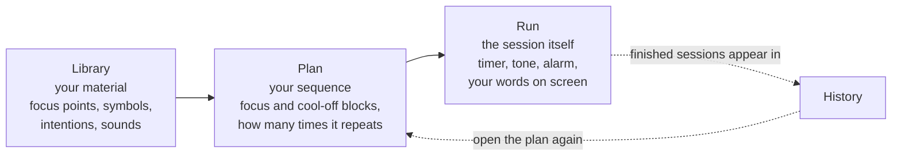

# Meditaur — User Guide

A complete, plain-language guide to Meditaur: what it is, what every screen does,
and how to build and run a meditation session from start to finish.

No technical knowledge is needed. Every button is named exactly as it appears on
screen, in `backticks`, so you can follow along with the app open next to you.

**Where to find it:** https://meditaur-web.vercel.app/ — open it in your browser,
or add it to your home screen so it opens like an app.

---

## Contents

1. [What Meditaur is](#1-what-meditaur-is)
2. [Before you begin](#2-before-you-begin)
3. [The big picture](#3-the-big-picture)
4. [Words you will see](#4-words-you-will-see)
5. [Your first session, in five minutes](#5-your-first-session-in-five-minutes)
6. [Finding your way around](#6-finding-your-way-around)
7. [Building your own plan](#7-building-your-own-plan)
8. [Running a session, in detail](#8-running-a-session-in-detail)
9. [The Library, section by section](#9-the-library-section-by-section)
10. [Binaural beats, in detail](#10-binaural-beats-in-detail)
11. [Spoken intentions](#11-spoken-intentions)
12. [Settings, explained](#12-settings-explained)
13. [Your data: backups and moving devices](#13-your-data-backups-and-moving-devices)
14. [Keyboard shortcuts](#14-keyboard-shortcuts)
15. [Troubleshooting](#15-troubleshooting)
16. [Glossary](#16-glossary)
17. [Not available yet](#17-not-available-yet)

---

## 1. What Meditaur is

Meditaur is a guided-timer app for meditation practice. It does three things:

- **It runs a timed sequence of meditation blocks for you**, so you are not
  watching a clock. You build the sequence once — a *plan* — and then simply sit.
- **It can generate binaural beats** (a low humming tone) that play underneath a
  block, using tone settings you control.
- **It shows you your own material while you sit** — the symbols, lines of
  intention, and tables you have written for each focus point.

Meditaur is a **wellness tool, not a medical device**. It does not diagnose,
treat, or cure anything, and it makes no medical claims. If you have a health
condition — in particular epilepsy, a seizure disorder, a heart condition, or a
hearing condition — talk to a doctor before using binaural beats. Do not use
Meditaur while driving or operating machinery, and stop if you feel unwell or
uncomfortable.

Meditaur contains two words in particular that are used in a very specific way:
**symbol** and **intention**. If you are new, read
[Words you will see](#4-words-you-will-see) before building anything.

---

## 2. Before you begin

| What you need | Why |
| --- | --- |
| **Headphones** | Binaural beats only work with headphones. Each ear needs to hear a slightly different tone. Through a speaker the effect disappears. |
| **A modern browser** | Chrome, Edge, Safari, or Firefox, reasonably up to date. |
| **Sound switched on and turned up** | Your device volume, and the volume controls inside Meditaur. |
| **Volume checked inside the app** | Meditaur starts at about 70% of your maximum output. See [Settings](#12-settings-explained). |
| **A quiet place, 5–15 minutes** | Even a short session works better without interruptions. |

Two practical tips:

- **Browsers do not allow sound until you interact with the page.** Meditaur is
  built around this: audio starts the moment you press `Start` (or the space bar).
  Nothing plays before that. There is nothing wrong if the app is silent until
  you press `Start`.
- **Put your phone on charge for long sessions.** Meditaur asks the browser to keep
  the screen awake while a session is running, but a long session still uses battery.

---

## 3. The big picture

Meditaur has three jobs, and each one has its own area of the app.

- **The Library** is where you keep everything: your focus points, your symbols,
  your lines of intention, your sound presets, your audio files, and your tables.
  It is your content, and it is reusable.
- **The Plan** is the running order. It says: focus here for 7 minutes, rest for
  3, focus there for 7 minutes, and repeat the whole thing once.
- **The session** is what happens when you press `Start`. Meditaur counts down,
  plays the tone, rings the alarm at the end of each block, and moves to the next
  part by itself.

A useful way to think about it: the Library is the kitchen, the Plan is the
recipe, and a session is cooking the dish.

You can use Meditaur without ever entering the Library. The app arrives
pre-filled with sensible starter content so you can sit immediately — see the
next section.

---

## 4. Words you will see

Meditaur uses a small vocabulary with specific meanings. These are worth five
minutes of your time, because the same words mean slightly different things in
some other meditation apps.

| Word | What it means in Meditaur |
| --- | --- |
| **Focus point** | The place you put your attention. Every chakra, every body point, and every custom entry is a *focus point*. Examples that come with the app: `Third-Eye Chakra`, `Root Chakra`, `Liver`, `Kidneys`, `Protection`. |
| **Kind** | What *type* of focus point it is. There are exactly three: **Chakra**, **Point**, and **Custom**. Chakra entries can carry extra details (description, what it governs, colour, element, and a picture). Point and Custom entries use your own [fields](#94-fields-your-own-columns) instead. |
| **Symbol** | A drawing or glyph you meditate on *for* a focus point. Symbols live in one shared library, and you attach them to focus points. The app ships with eight examples: `Rama`, `Zonar`, `Halu`, `Harth`, `Gnosa`, `Iava`, `Kriya`, and `Shanti`. One symbol can be attached to many focus points. |
| **Intention** | A short line of text you say or hold in mind. An intention can be attached to a focus point, to a symbol, to both, or to nothing at all. (Older versions of the app called these "affirmations"; that is the same thing.) |
| **Field** | Your own extra column. If you want to track something the app does not have a box for — a colour, a note, a reference number — you add a field and it appears on that kind of entry. |
| **Preset** | A saved binaural sound: the tones in your left ear, the tones in your right ear, the fade in and out, and the EQ. |
| **View** | A saved table layout, used to display rows of symbols (and their fields) on the run screen during a session. |
| **Plan** | Your running order: a list of blocks, plus how many times it repeats. |
| **Block** | One step inside a plan. There are two kinds: a **focus block** (meditate on something) and a **cool-off** block (rest, or a pause between two focus blocks). |
| **Cycle** | One full pass through every block in the plan. A plan with 16 blocks and 3 cycles runs those 16 blocks three times. |
| **Cool-off** | A rest block. It has a duration and can play a tone, but it has no focus point and no symbols — nothing to concentrate on. |
| **Session** | One complete run of a plan, from the first block to the last. |
| **Master volume** | The overall loudness of everything Meditaur plays. |
| **Alarm volume** | The loudness of the sound that marks the end of a block. |

---

## 5. Your first session, in five minutes

You do not need to create anything. The app arrives ready to use.

1. **Open Meditaur.** You land on the welcome screen, which says `Meditaur`
   and offers two buttons you need: `Start session` and `Open planner`. (There is also
   an `Account` button beside them; you never need it.)
2. **Put your headphones on**, and check your device volume.
3. **Press `Start session`.** Meditaur takes the plan you used last (the one that comes
   with the app is called `Circuit session`) and opens the run screen.
   - If you see `No plan to start. Open the planner first.`, there is no plan yet —
     open the planner and press `New plan`.
   - If you see `Still starting up. Try again in a moment.`, give it a second and
     press `Start session` again.
4. **Look at what is on screen.** At the top left is `Back`. Beside it is the name
   of the focus point, and on the right is **`Length of this block`** with the
   minutes and seconds wheels, set to that focus point's usual length. Below that
   is your material for the block, under the heading `Intentions`. Nothing is
   playing yet.
5. **Set the length if you want a different one** — scroll a wheel, drag it up or
   down, or press it and type a number. See
   [§8.1](#81-what-you-see-before-you-start) for how the wheels work. This
   changes **this session only**; the focus point's own
   default length lives in `Library → Focus points → Edit → Default duration`.
6. **Press `Start`** (the large button at the bottom), or press the **space bar**.
   The timer starts counting down, the tone fades in, and your intention lines
   are on screen in front of you.
7. **Meditate.** You do not need to touch anything. When the block ends, the alarm
   sounds, there is a brief pause, and the next block begins on its own.
7. **When the session finishes**, the screen shows `Start another session`, which returns you
   to the planner. The session is now recorded in **Library → History**.

If you want to stop early, press `Stop`, or press the **Escape** key. To skip
ahead to the next block, press `Skip` or the **right arrow** key.

The starter plan (`Circuit session`) is a 17-block circuit: focus blocks for six
chakras, plus `Protection`, `Liver` and `Kidneys`, separated by cool-off rests of
just over three minutes. Chakras are seven minutes each, `Protection` is
eleven minutes, and `Liver` and `Kidneys` are five minutes each. That is a long
session — if you want something shorter for your first attempt, open the planner and
delete blocks, or change the durations. See the next sections.

---

## 6. Finding your way around

Meditaur has a welcome screen and four main areas, plus a full-screen run view.

| Screen | What it is for |
| --- | --- |
| **Welcome** (`Start session`, `Open planner`) | The front door. Starts a session or opens the planner. |
| **Plan** | Builds and edits your meditation sequence. |
| **Library** | Holds all your material: focus points, symbols, intentions, fields, audio files, presets, views, plans and history. |
| **Run** | The full-screen session itself. |
| **Settings** | Loudness, text size, the voice, and defaults for new plans. |
| **Binaural tuner** | A live laboratory where you adjust tones and hear them immediately. A preset's editor has the same controls under its name, and `/tuner` opens one on its own. |

(The welcome screen also has an `Account` button. You never need it.)

**The navigation bar.** On `Plan`, `Library` and `Settings` there is a bar at the
top with a link for each area, and the link for the area you are currently in is
highlighted. Two exceptions:

- The **welcome screen** has no navigation bar.
- The **run screen** has no navigation bar and no other chrome, so that nothing
  distracts you while you sit.

**Getting back.** Every editor screen has a `Back` button in the top-left corner.
Inside the Library, `Back` always returns you one step, and you can press it
repeatedly to get back to the Library home.

**A small quirk worth knowing:** the welcome screen is only reachable at the
app's main address. Nothing inside the app links back to it. If you like starting
there, bookmark it. The run screen's `Start another session` button, and the planner's
`Start session` button, both return you to `Plan`, not to the welcome screen.

---

## 7. Building your own plan

Open `Plan` from the welcome screen (`Open planner`) or from the navigation bar.

### 7.1 What a plan looks like

At the top of `Plan` you will see a row of **focus tiles**, grouped under the
headings `Chakras`, `Points` and `Custom`. Each tile is a small button only as
wide as the name inside it, and they wrap onto as many rows as they need, so a
long list of focus points stays compact. These are shortcuts: tapping one starts
a session immediately, using just that one focus point. They are quick, but they do
not ask for confirmation — see [§7.2](#72-a-warning-about-the-focus-tiles).

Below the tiles is your plan, in this order:

- The **plan tools in one strip** — `Switch plan`, `New plan`, `Duplicate plan`,
  and `Delete plan` when there is more than one plan. The tools sit in their own
  outlined strip, so "what starts a session" and "which plan am I editing" never
  read as one row of buttons.
- The **plan name** in an editable box.
- The **two add actions** — `Add focus` and `Add cool-off`. Nothing else sits
  under the name.
- The **blocks**, as a row of cards you can scroll sideways.
- The **plan-wide settings**: `Cycles`, `Repeat until stopped`, `Auto-advance`,
  and `Binaural beats`. (`Stop binaural when alarm rings` is a [Settings](#12-settings-explained)
  switch now, not a plan one — one setting, one place.)
- The **buttons at the very bottom**: `Save` and `Start session`. They are the
  same size; `Start session` is the filled one, because starting the run is what
  the page is for.

If there is no plan yet, the page says `No plan` and offers a `New plan` button.
New plans are created with the name `New session`, then `New session 2`, `New session 3`, and
so on.

### 7.2 A warning about the focus tiles

The focus tiles at the top of `Plan` start a session **immediately** when tapped.
There is no "are you sure?" step. If you tap a tile by accident, press `Stop` on
the run screen (or press Escape), and you will be returned to the planner.

### 7.3 Adding your first block

1. Press `Add focus`. A card appears.
2. On the card, press the `Focus` field to pick which focus point this block is
   about — the field's value reads `Choose` until you do. A picker opens; see
   [§9.12](#912-the-picker-one-text-bar-everywhere) for how to use it. Tap the
   focus point you want.
3. Press the `Symbol` field to choose what you will look at during this block
   (see [§7.5](#75-choosing-a-symbol)).
4. Set the length with the `Minutes` and `Seconds` steppers.
5. Press `Add cool-off` to add a rest block after it, and give it a length too.

That is already a workable plan: focus, rest, done.

### 7.4 What each card shows

Every block card shows the same set of controls, top to bottom. Each field button
reads the same way: the field's name in small capitals, centred above the value
you have chosen.

| On the card | What it does |
| --- | --- |
| `Focus` or `Cool-off` | The card's name, on its top line beside `Remove`. Press and hold it to slide the block left or right to reorder the plan — it is the drag handle. |
| `Remove` | Sits beside the handle, not at the bottom, so every card lines up however many fields it has. Press it twice — the first press fills it and asks `Remove?` (see [§9.11](#911-deleting-rules-the-two-press-and-the-five-second-window)). |
| `Minutes` / `Seconds` | The length of the block, as two wheels (see [§8.1](#81-what-you-see-before-you-start)). Minutes go up to 180; seconds from 0 to 59. |
| `Focus` | Which focus point this block is about; the value reads `Choose` until you pick one. Focus blocks only. |
| `Symbol` | Which symbol (or symbol rule) to show. Focus blocks only. |
| `Binaural` | Which binaural sound plays during this block. `None` means silence. |
| `Table` | Which table to show on screen during this block. `None` means no table. |
| `Ambient` | A background audio file to play during this block. `None` means none. |
| `Alarm` | The sound that marks the end of this block. `Beep` is the built-in alarm. |

Every card is the same height as the tallest one in the row, so the strip reads as
one line of cards rather than a ragged set.

A cool-off block shows only the drag handle, the duration, `Binaural`, `Table`,
`Ambient`, `Alarm` and `Remove`. It has no focus point and no symbols, because
there is nothing to concentrate on.

A value longer than the card is shortened with an ellipsis (`Third-Eye Chakra`
fits; an unusually long asset name does not). Open the field to see the full list.

### 7.5 Choosing a symbol

Tapping the `Symbol` field opens a small menu with three kinds of choice:

- **`Rotate next`** — Meditaur walks through the symbols attached to this focus
  point, one per block. If you have three symbols attached and three focus blocks
  for that point in your plan, you will see the first, then the second, then the
  third.
- **`All symbols`** — the whole sheet. Every symbol attached to the focus point
  is shown together, in one long list.
- **A single symbol by name** — only that one symbol is shown.

Only symbols that are attached to the chosen focus point appear in this list. If
the list looks short or empty, the focus point needs symbols attached to it —
that is done in the Library (see [§9.1](#91-focus-points)).

### 7.6 Reordering, duplicating and removing blocks

- **Reorder:** press and hold a card's drag handle and slide it left or right. The
  other cards move out of your way. A card only ever moves sideways: the row
  scrolls horizontally, never vertically, so a card can never drift out of the row.
- **Remove:** press `Remove` on the card. This is immediate — there is no undo,
  and no confirmation.
- **Add:** `Add focus` and `Add cool-off` add new cards at the end.

### 7.7 Repeats: cycles and "repeat until stopped"

These two controls decide how long the whole sequence runs.

| Control | What it does |
| --- | --- |
| `Cycles` | How many times the entire block list repeats. Use the + and − buttons to set a number from 1 to 99. One cycle means play the blocks once and finish. |
| `Repeat until stopped` | Ignores `Cycles` and repeats the blocks forever, until you press `Stop` (or Escape). Use this for open-ended practice. |

The run screen tells you which cycle you are in — the label beside `Back` reads
`Root Chakra · cycle 2` when the second pass begins.

### 7.8 Auto-advance

`Auto-advance` decides what happens when a block's timer reaches zero:

- **On** — the alarm sounds and Meditaur moves to the next block by itself, after
  a short pause. This is the hands-off mode: you press `Start` once and sit.
- **Off** — the alarm sounds and the timer stops. Nothing moves until you press
  `Skip` (or the right arrow key). This is useful when you want to sit for as
  long as each block needs, and move on when you feel ready.

### 7.9 The sound of a block

Each block can have up to three sounds, all chosen from the card:

- **`Binaural`** — the generated tone that plays *during* the block. Pick a
  preset, or `None` for silence. This is the hum you sit inside.
- **`Ambient`** — an audio file (rain, a recording, a track) that plays during the
  block, looping until the block ends.
- **`Alarm`** — the sound that marks the end of the block. `Beep` is Meditaur's
  built-in short tone; anything else is one of your own uploaded files.

Ambient and alarm files are added in the Library, under `Audio files`. See
[§9.5](#95-audio-files).

### 7.10 Showing a table during a session

`Table:` lets you display a table on the run screen during a block. This is for
symbols with lots of detail — for example, a table of every symbol with its
description and its intentions. Build the tables first in
**Library → `Views`** ([§9.7](#97-views)), then choose one per block here.

### 7.11 The plan-wide sound switches

At the bottom of `Plan` are two switches that apply to the whole plan:

| Switch | What it does |
| --- | --- |
| `Binaural beats` | The master switch for tone. Turned **off**, no block in this plan plays binaural tone, no matter what each block says. Turned **on**, each block decides for itself. |
| `Auto-advance` | The same setting described in [§7.8](#78-auto-advance), shown here so you can set it for the whole plan. |

`Stop binaural when alarm rings` used to sit here as well. It is a
[Settings](#12-settings-explained) switch now — one setting, one place — and it
is the one a session obeys.

There is a fourth, subtler switch on each *focus point* in the Library, which can
also silence tone for that focus point alone. See
[§10.6](#106-the-two-onoff-switches).

### 7.12 Saving, switching, and copying plans

| Button | What it does |
| --- | --- |
| `Save` | Saves your work. While there are unsaved changes it reads `Save · unsaved`. |
| `Start session` | Saves, then **starts the run** with this plan. This is the normal way to begin a planned session. |
| `Switch plan` | Opens the list of all your plans so you can move to a different one. |
| `New plan` | Creates a fresh, empty plan named `New session`. |
| `Duplicate plan` | Makes a copy of the current plan, called `<name> copy`, and switches to it. Handy for variations: copy, then change the durations. |
| `Delete plan` | Deletes the current plan after a two-press confirmation (see [§9.11](#911-deleting-rules-and-the-two-press-safety)). It only appears when you have more than one plan, and Meditaur refuses to delete your very last plan with the message `Keep at least one plan`. |

**You rarely need to press `Save`.** Meditaur saves your plan automatically about
half a second after you stop changing something, and again when you leave the
page. `Save · unsaved` is just a reassurance indicator — it will clear itself.

If you have the same plan open in two browser tabs and edit in both, one of them
shows `Plan was changed in another tab`. Reload the page to pick up the newest
version.

---

## 8. Running a session, in detail

The run screen is deliberately bare: no navigation bar, no menus, just the timer
and your material. This is the screen you will spend your practice on.

### 8.1 What you see before you start

From top to bottom:

1. **`Back`**, at the top left. It returns you to the planner — and it ends the
   session, so do not use it to pause.
2. The **name of the focus point** you are on. A rest block reads `Cool-off`. If
   the plan repeats more than once, the label says which repeat you are in
   (`Root Chakra · cycle 2 of 3`); a single-cycle session says nothing, because
   there is no second cycle to speak of.
3. **`Length of this block`**, on the right, with two wheels — minutes and
   seconds, sharing one highlighted band. Turn a wheel with the **scroll wheel**
   of a mouse or with a trackpad, or **drag it up to increase** and **down to
   decrease**; the neighbouring numbers stay visible above and below it, and the
   minutes and seconds always line up. **Press a wheel without moving** and it
   becomes a box you can type a number into; `Enter` accepts it, `Escape` puts
   the old number back, and anything that is not a number changes nothing. The
   arrow keys, `PageUp`/`PageDown` and `Home`/`End` work too when a wheel has
   keyboard focus.
   This is the round-up of the whole quick-session idea: tap a chakra on `Plan`,
   set the length you actually have, press `Start`.
4. **Your intentions**, under the heading `Intentions`. Lines attached to the
   focus point itself come first, with no symbol column. Then each symbol gets a
   group of rows: the symbol's picture (if you uploaded one), its name, its
   description and its usage appear once, in the left-hand cell, and that cell
   stretches down beside every intention line belonging to that symbol. A `-`
   marks a description or usage you have not written.
5. **The table**, if the block has one — the view's name as a heading, then its
   rows.
6. The **control bar**, pinned to the bottom: `Start` before you begin, then
   `Pause`, `Skip` and `Stop` once it is running, with the `Auto-advance` switch
   beside them.
7. A **keyboard legend** on wide screens, drawn as keys rather than as a
   sentence, and it only lists the keys that do something right now:

| Shown | When | What it does |
| --- | --- | --- |
| `Space` `start` | before you begin | Starts the session — the same as pressing `Start`. |
| `Space` `pause` | while it runs | Pauses; presses again to resume. |
| `→` `skip to the next block` | while it runs | Ends this block now and moves on. It is **not** offered before you start, because there is nothing to skip to yet. |
| `Esc` `end the session` | always | Ends the session and returns you to the planner. |

Once the session is running, the length control is replaced by the countdown.
Nothing plays until you press `Start`.

### 8.2 Starting

Press `Start`, or press the **space bar**. Meditaur will:

- Check that no session is already running in another browser tab.
- Ask the browser to keep your screen awake (where the browser supports it).
- Wake up the audio, fade in your binaural tone, and begin block one at 0:00 of
  the countdown.

If you see `A session is already running in another tab`, you have Meditaur open
somewhere else with a session in progress. Close or stop that one first.

### 8.3 During a session

Nothing needs your attention. The countdown runs, the tone plays under it, the
alarm marks the end of each block, and the next block begins by itself when
`Auto-advance` is on. Your intentions and symbols stay on screen for the whole
block.

### 8.4 Keys and buttons

| What you press | What happens |
| --- | --- |
| **`Start`** or **space bar** | Begins the session. |
| **space bar** while running | Pauses. |
| **space bar** while paused | Resumes. |
| **`Pause`** | Pauses. The tone stops and the timer holds where it is. |
| **`Resume`** | Continues from exactly where you paused. |
| **`Skip`** or **right arrow** | Ends the current block immediately and moves to the next one. No alarm is played. |
| **`Stop`** or **Escape** | Ends the whole session and returns you to the planner. |
| **`Auto-advance`** | A switch on the run screen too. Changing it here affects only the current session — it does not change the plan itself. |
| **`Start another session`** | Appears once the session is finished. Returns you to the planner so you can choose or build another one. |

The legend at the bottom of the screen lists the keys that work at that moment,
drawn as keys: `Space` `start` or `pause`, `→` `skip to the next block`, and
`Esc` `end the session`.

Keyboard shortcuts work on a computer. On a phone or tablet, use the on-screen
buttons.

### 8.5 What happens at the end of a block

1. The block's alarm plays — your chosen file, or the built-in `Beep`.
2. Depending on the `Stop binaural when alarm rings` switch in `Settings`, the
   tone either fades out completely, or drops to a quiet background level.
3. If `Auto-advance` is on, Meditaur waits for the alarm to finish (a moment, for
   the built-in beep; longer for a longer file) and then starts the next block.
   If `Auto-advance` is off, the app waits for you to press `Skip`.

### 8.6 Finishing, stopping early, and starting over

- **Finishing** the last block ends the session. The tone fades out, the screen
  shows `Start another session`, and the session is written into
  **Library → `History`**.
- **Stopping early** — `Stop` or Escape — ends the session with no alarm, and does
  **not** record anything in History. History only counts sessions you completed.
- **Reloading the page** or closing the tab during a session ends it. When you
  come back, the run screen will offer `Start` again from the **beginning** of the
  plan; Meditaur cannot resume a session part-way after a reload.
- **Changing what is on screen** — leaving the run screen, locking your phone, or
  switching to another app may also interrupt the audio, depending on your
  device. For best results, leave the run screen open.

### 8.7 Keeping the screen awake

While a session is running, Meditaur asks the browser to keep the screen on. Most
browsers cooperate, but they can also take that permission back (for example if
you switch to another app, or if your device has a strict battery-saving mode).
If your screen keeps going dark mid-session, turn off or extend your device's screen
timeout in your device settings.

### 8.8 One session at a time

Meditaur allows a single session at a time per browser. If a run is already going
and you press `Start session` again from another tab — in the planner or on the
welcome screen — the first run keeps running, and the second request simply
returns you to it. Pressing `Start` in a second tab gives you `A session is
already running in another tab`.

---

## 9. The Library, section by section

The Library is the largest area of the app, because it holds all your material.
Open it from the navigation bar.

At the top of the Library you will find:

- **`Download catalog`** and **`Restore catalog`** — the whole-library backup and
  transfer tools, which is why they sit at the top of the page rather than inside
  a section. See [§13](#13-your-data-backups-and-moving-devices).
- **The section tabs**, one per area of the Library: `Focus points`, `Symbols`,
  `Intentions`, `Fields`, `Audio files`, `Presets`, `Views`, `Plans`, `History`.
  The tab that is lit up is the section you are in, so the page repeats no title
  of its own.
- The section's **`Add …` action** at the left of the row, with the **`Table`**
  switch and **`Columns`** beside it — the view controls for the three sections
  that offer both views. See
  [§9.10](#910-cards-table-views-and-the-table-switch).

The Library remembers which tab you were last in for the current browser tab, so
a refresh brings you back to the same section. A brand-new tab starts at the top.

Every screen inside the Library is left with its `Back` button **or the
**Escape** key** — the two do exactly the same thing, including leaving an
unsaved draft behind. Escape is not a cancel; nothing is saved on the way out.

### 9.1 Focus points

A focus point is a place you put your attention: a chakra, a body point, or
something entirely your own.

The list shows each focus point with its picture (or `No image`), its name, its
kind and location, and how many symbols are attached to it. Press `Add focus
point` to create one. **Pressing a card — or anywhere on a row, in table view —
opens that focus point's page**, and the page itself is read-only:

| On the page | What it does |
| --- | --- |
| `Edit` (bottom bar) | The form where you change everything, including the symbols, intentions and custom fields. |
| `Edit` (on the card, in the list) | A shortcut to that same form. |
| `Delete` (on the card, in the list) | Removes the focus point, after a second press (see [§9.11](#911-deleting-rules-and-the-two-press-safety)). |

**Creating a focus point**

1. Choose a kind: `Chakra`, `Point`, or `Custom`.
2. Give it a `Name`.
3. Optionally add a `Location` in words — for example `Between the eyebrows`.
4. Set a `Default duration` with the `Minutes` and `Seconds` steppers. This is the
   length Meditaur uses when you pick this focus point in a plan.
5. Optionally set a `Default sound` — the binaural preset this focus point uses by
   default. When you later pick this focus point in the planner, this sound and
   this duration are copied onto the block for you.
6. If you chose **Chakra**, extra boxes appear: `Description`, `Governs`,
   `Colour`, `Element`, a `Representation` image, and `Representation
   description`. These are for the traditional chakra correspondences.
7. Press `Save`. You land on the new focus point's page, ready to attach its
   symbols.

**The focus point page shows; it does not change anything.** Opening a focus
point gives you its chakra block, its custom field values — each one under its own
heading — its symbols in the order `Rotate next` will walk them, its intention
lines, and its binaural state. Nothing you can press changes the focus point by
accident. `Edit` in the bottom bar opens the form, and the form is where all of
the following live:

- **Your custom fields** — each field is its own section here, under its own
  heading, with one box for *this* focus point's text. Type in them, then press
  `Save fields`. `Add custom fields` sits on the line under the fields and takes
  you to a new field that every focus point will then have (and it brings you
  back here when you save it). `Delete <heading>` beside a field's heading removes
  that field from every focus point, with everything that was typed into it — it
  asks for a second press first, and says what else goes.
- `Symbols` — press `Add symbol` to attach one (a picker opens showing the symbols
  that are not attached yet). Attached symbols can be **dragged** by their name to
  reorder them, and `Remove` takes one off this focus point. The order here is the
  order `Rotate next` follows in the planner, so it is worth arranging.
- `Intentions` — press `Add intention` to write a line for this focus point. Each
  row shows the line and the symbol it is paired with, if any. `Edit` opens the
  line, `Remove` deletes it, and the rows reorder by dragging.
- `Binaural` — the assigned `Preset`, the `Binaural beats` switch, and
  `Open binaural config`.

If the focus point has no symbols yet, the form tells you with `Add a symbol
first` or `All symbols are attached`. Changes to symbols, intentions and custom
fields save as you make them; the name, kind, location, duration and picture save
when you press `Save`, and a draft of those is written before the form hands over
to a picker, so `Back` never loses them.

**Deleting a focus point takes what was written about it with it.** The first
press says so before anything happens: while the button is armed it shows the
damage underneath in plain words, for example `This also removes 2 blocks from 1
plan, 1 intention and 3 symbol attachments.` The second press then removes the
focus point, unbinds its symbols, drops its intention lines and its custom field
values, and removes the plan blocks that used it. If the sentence names nothing,
the focus point is unused and only it goes.

### 9.2 Symbols

Symbols are the drawings or glyphs you meditate on. They live in one shared
library, and you attach them to focus points.

Press `Add symbol` to create one. **Pressing a symbol's card — or its row, in
table view — opens that symbol's own page**: its picture, description, usage, your
custom field values under their own headings, and the focus points it is attached
to. Like a focus point's page, it only shows; `Edit` in the bottom bar (or on the
card) opens the form. Each symbol has:

| Box | What it is for |
| --- | --- |
| `Name` | What the symbol is called. |
| `Image` | The symbol's picture. Press it to upload a file. |
| `Description` | A short summary — what the symbol is for, in one or two lines. |
| `Usage` | How to practise with it. This is the longer text. |
| Heading line of each field | Your own box for this symbol, exactly as a focus point has — the field's own heading names the section, `Add custom fields` makes a new one just above `Save fields`, and `Save fields` writes what you typed. `Delete <heading>` removes the field itself, from every symbol. Any [field](#94-fields-your-own-columns) you created for symbols appears here. |

Press `Save` when done. **Deleting a symbol** removes it, unbinds it from every
focus point, drops the intention lines that named it, and clears its custom field
values. Plan blocks that named *that* symbol keep their place and fall back to
`Rotate next`, so the block goes on walking the focus point's remaining symbols —
the armed button says how many places that affects (`1 place that pointed at it
is cleared.`).

Images: PNG, JPEG, WebP and GIF are accepted, up to 2 MB each. Transparent-background
images look best — the app frames every image softly so that pictures with a white
background do not look out of place. A symbol's picture also appears beside its
name on the run screen, next to its intention lines.

### 9.3 Intentions

An intention is a line of text you hold in mind. This section lists every
intention in your library, regardless of what it is attached to, and shows its
attachment — or `Unassociated` if it is attached to nothing.

Press `Add intention` to write one. An intention has:

- a `Text` box for the line itself, and
- an `Associated with` control with four choices: **None**, **Focus point**,
  **Symbol**, or **Both**.

If you choose Focus point or Both, a `Focus point` row appears. If you choose
Symbol or Both, a `Symbol` row appears. Each row shows its value, or `Choose`
until you pick one — press it and the picker opens. The picker has a **text bar**:
type part of the name and the list narrows as you type, then press `Choose` (or
Enter) to take the name you typed, or press one of the options. A name that
matches nothing is refused with a message and nothing is selected, so a typo
cannot quietly attach a line to the wrong symbol.

You can also add intentions directly from a focus point's page — press `Edit`,
and the same controls appear there — which is often faster when you are working
through one focus point at a time. An intention attached to both a focus point
and a symbol only shows up during a block when that focus point *and* that symbol
are on screen together.

**A note about the intentions that come with the app.** The starter set is a real
practitioner's own material, and some lines contain blank markers like `<>` where
a name or detail belongs. These are examples, not prescriptions — read through
them and replace them with your own words. Your practice works better with lines
you have written yourself.

### 9.4 Fields (your own columns)

Fields are how you add your own information to symbols and focus points without
waiting for the app to grow a new box.

The `Fields` section lists every field you have, and offers three filter tiles:
`All`, `Symbol`, and `Focus point`. Press `Add symbol field` or `Add focus point
field` to create one, or press an existing field to edit it.

Each field has:

| Box | What it is for |
| --- | --- |
| `Applies to` | Whether this field shows on `Symbol` entries or `Focus point` entries. It is a choice only when you start from the `Fields` tab; making a field from a symbol's or a focus point's own form already knows, and says so instead. |
| `Heading` | The heading you will see, in plain words. For example `Colour`. This is the word that appears above the box on every entry of that kind, above the value on its page, and it is the section heading in the entry's own form. |
| `Description` | A line saying what the field is for, shown under the heading on the field's card in the `Fields` tab and under the value on an entry's page. Optional, and deliberately not drawn in the edit form. |

Once a field exists, its own section appears in the form of every entry of that
type — on the symbol's form, and on the focus point's — with one box under its own
heading. Type a value and press `Save` (or `Save fields`). **Clearing the box
removes the value entirely** rather than storing an empty one.

The field's own page shows the value under the field's heading, next to that
entry's own headings, so you read `Colour: Blue` rather than a list under one
`Custom fields` heading. **Deleting a field** — `Delete <heading>` in an entry's
form, or `Delete` on the field's card — takes the field from every entry of that
type, with the values that were typed into it, and drops it as a column from any
table view that used it. The first press names what goes; the second does it.

Fields are also selectable as columns in table views, so a field you invent can
become a column in your session table.

**Deleting a field** removes its values everywhere — on every symbol and focus
point that had one — and strips the field from any table view that showed it as a
column. The armed button says how many values go with it.

### 9.5 Audio files

This is where you add your own sounds. The section has two lists: `Ambient`
(background audio that plays during a block) and `Alarm` (the sound that marks
the end of a block).

Press `Add ambient file` or `Add alarm file` and choose a file from your device.
Meditaur records the file's length and lists it with its name and duration. Once
added, a file becomes selectable on any block card in the planner.

Rules to know:

- **Audio files** up to 10 MB. MP3, WAV, OGG, WebM, MP4/M4A, AAC and FLAC are
  accepted. The file must be one your browser can actually play, otherwise
  Meditaur says the file type is not supported.
- **Images** (for symbols and chakra representations) up to 2 MB. PNG, JPEG, WebP
  and GIF.
- **Deleting** a file clears the references to it rather than refusing: a plan
  block that used it as its `Ambient:` or `Alarm:` sound keeps its place and loses
  the sound, and a chakra representation image leaves its focus point with no
  picture. The armed button tells you how many places were cleared.

### 9.6 Presets

A preset is a saved binaural sound. The `Presets` section lists them with their
left- and right-ear tone counts. The app arrives with twenty examples, based on
Solfeggio frequencies and on 432 Hz tuning, one for each of the starter focus
points.

Press `Add preset` to make one, or `Edit` on a card to open an existing one.

**The preset editor holds the sound itself** — the name, then the tones, the
fades and the EQ right below it, which is the [tuner](#104-the-binaural-tuner)'s
controls on the page instead of behind another screen. There is nothing to open:
the sound is here.

| Control | What it does |
| --- | --- |
| `Name` | The preset's name. |
| `Left ear` / `Right ear` | Which ear you are editing. |
| `Add tone`, `Add beat pair` | Adds a tone, or a classic left/right pair, to that ear. |
| `Hz` / `Gain` | The frequency and loudness of one tone. |
| `Remove tone` | Removes that tone. |
| `Fade in ms` / `Fade out ms` | How long the sound takes to arrive and to leave. |
| `Link EQ ears` | Keeps both ears' equaliser in step. |
| Ten EQ bands | From `32 Hz` to `16000 Hz`, ±12 dB. |
| `Save` | Writes your changes. Unlike the tuner, this screen does not save as you go. |
| `Delete preset` | Removes the preset. Blocks that used it lose their sound and keep their place; a focus point that used it as its default loses the default. |

Each card in the list carries `Duplicate` beside `Edit`, so you can copy a sound
without opening it first: `Duplicate` makes a copy called `<name> copy`, so you
can vary a sound without losing the original.

To hear a sound while you work on it, use the [tuner](#104-the-binaural-tuner),
or a focus point's `Open binaural config`, which adds a `Try` button and a draft
you can throw away.

A preset is removed with its references cleared — see §9.11 — but **your last
preset is protected** (`Keep at least one preset`): a workspace always keeps one
sound.

### 9.7 Views

A view is a saved table you can display on the run screen while a session runs. It is
meant for symbol-heavy practice, where you want a lot of detail visible at once.

Press `Add table view` to create one. A view has:

| Control | What it does |
| --- | --- |
| `Name` | What the table is called. |
| `Rows` | Which symbols the table lists: `This block` (only the symbol you are on), `Focus point` (every symbol attached to the current focus point), or `All symbols` (your entire symbol library). |
| Column switches | One switch per available column. Built-in columns are `Name`, `Image`, `Kind`, `Location` and `Symbols` for focus points, and `Name`, `Image`, `Description` and `Usage` for symbols — plus every custom [field](#94-fields-your-own-columns) you have created. |
| The `Add …` action | Sits where the section's heading used to be, at the left of the row, with the display switch and `Columns` at the right. |
| `Save` | Saves the view. |
| `Delete table view` | Removes the view. Blocks that displayed it fall back to no table. |

Meditaur requires at least one column: `Pick at least one column`. A view is
removed with its references cleared, but your last remaining view is protected
(`Keep at least one table view`).

Once a view exists, choose it on any block card in the planner with `Table:`.

### 9.8 Plans

This section is a simple list of every plan you have. Press a plan's name to open
it in the planner. This is the easiest way to jump between plans, and it is also
where you will notice any plan Meditaur created for you automatically — for
example, single-focus sessions created from the focus tiles appear here as
`Focus session`.

### 9.9 History

History is your log of **completed** sessions. At the top it shows
`Sessions completed this week:`, followed by a number, counting from Monday.
Below that, each completed session is listed with the plan's name, how long it
ran, and when you finished.

If you have not finished a session yet, the section reads `No completed sessions
yet.`

What counts and what does not:

- **Counts:** sessions you run all the way to the end.
- **Does not count:** sessions you `Stop` or end with Escape, blocks you `Skip`,
  and sessions interrupted by closing the tab or reloading.

Meditaur keeps the most recent 50 sessions per device. Older entries drop off the
list automatically. Deleting a plan also removes that plan's history entries.

### 9.10 Cards, Table views and the `Table` switch

Three sections — `Focus points`, `Symbols` and `Intentions` — can be shown either
as **cards** or as a **table**, and the section header carries one switch for it:

- **`Table` off** — the section shows **cards**: each entry is a block with its
  image, name, a line or two of detail, and its own `Edit` and `Delete` buttons.
- **`Table` on** — the same entries as rows, like a spreadsheet, and the
  **`Columns`** action appears beside the switch. Press `Columns` to open a panel
  of switches, one per available column, so you can turn individual columns on and
  off. While that panel is open the `Columns` button stays selected, so you can
  see it is the one you pressed.

**Pressing an entry is how you open it** — the whole card, or anywhere on a row.
That opens the entry's read-only page; `Edit` next to it, on the card, goes
straight to the form. In table mode only the card carries `Edit` and `Delete`.

The switch only appears in the three sections that have a table: `Fields`,
`Audio files`, `Presets`, `Views`, `Plans` and `History` list their entries as
cards with the same actions.

Meditaur remembers your choice per section, and remembers which columns you
switched on. Switch back to cards any time; nothing is lost.

### 9.11 Deleting: rules, the two-press, and the five-second window

Meditaur never deletes your material silently. Two rules apply everywhere:

**1. A two-press confirmation with a five-second window.** When you press a
delete button, it does not delete. Instead it arms itself, fills with a light
red, and changes its label to include a question mark — `Delete focus point`
becomes `Delete Heart Chakra?`. Pressing it again fills it dark red as it goes
and the item is deleted. If you do nothing, the button puts itself back after
**five seconds**, so a half-pressed delete cannot sit there waiting for a stray
tap. Pressing anything else cancels it at once.

This is every delete in the app — focus points, symbols, intentions, fields,
presets, views, audio files, plans, and a plan's blocks. The one exception is
`Remove tone` in the tuner and in a focus point's binaural page: that edits a
draft you have not saved, and the `Revert` button beside it is the undo.

**2. Whatever else goes is named first.** Meditaur removes references rather than
refusing, so the armed button tells you what the delete would take with it. Two
kinds of sentence appear under it:

| Sentence | What it means |
| --- | --- |
| `This also removes 2 blocks from 1 plan, 1 intention and 3 symbol attachments.` | These things stop existing. The count covers plan blocks, intention lines, symbol attachments and custom field values. |
| `1 place that pointed at it is cleared.` | These things stay, but lose what they pointed at — a plan block keeps its place and falls back to `Rotate next`, or a block loses its ambient sound. |

Nothing is listed when nothing else is affected. There is no undo, so read that
line before the second press.

Only three deletes still refuse outright, and each says why:

| Message | What to do |
| --- | --- |
| `Keep at least one plan` | A workspace must always have at least one plan. Create a new one first. |
| `Keep at least one preset` | A workspace always keeps one binaural sound. Add another preset first. |
| `Keep at least one table view` | A workspace always keeps one table view. Add another first. |

There is no undo anywhere in Meditaur. If you are about to do something
significant, press `Download catalog` first — that backup is your safety net.

### 9.12 The picker: one text bar, everywhere

Whenever Meditaur asks you to choose something — a focus point, a symbol, a
sound, a table, an alarm — you get the same screen, and it works the same way:

| Control | What it does |
| --- | --- |
| The **text bar** | Type any part of the name and the list below narrows as you type. It also searches the small line under each name, so you can find a symbol by where it is used. |
| `Choose` | Takes the name in the text bar. If the text matches no option, Meditaur refuses: `Nothing matches “...”, so nothing was chosen.` Nothing is saved on a typo. |
| The **list** | Press any option to take it directly, without typing. The current choice, if there is one, is filled in. |
| `Back` | Leaves without choosing. `Escape` does the same, on every picker. |

Long names are cut short with an ellipsis rather than spilling out of their row,
so a row never looks broken however long the text is.

---

## 10. Binaural beats, in detail

### 10.1 What they are, and how Meditaur makes them

A binaural beat is what you hear when each ear receives a steady tone at a
slightly different pitch. Your brain perceives a third, pulsing rhythm at the
difference between them. If the left ear hears 200 Hz and the right ear hears
208 Hz, you perceive an 8 Hz beat.

**Headphones are required.** Over a speaker the two tones mix in the air before
they reach your ears, and the effect is lost.

Meditaur generates these tones live rather than playing a recording, so you can
tune them exactly. Each ear can have up to **16 separate tones**, each with its
own frequency and loudness, and each ear has its own 10-band equaliser.

There is a small convenience called `Add beat pair` (and a set of band tiles) that
creates the classic left/right offset for you, if you would rather not work out
the numbers by hand.

### 10.2 The classic bands

The tuner's band tiles create well-known beat rates in one press:

| Tile | Beat rate | Traditionally associated with |
| --- | --- | --- |
| `Delta 2 Hz` | 2 Hz | Deep sleep, restoration |
| `Theta 6 Hz` | 6 Hz | Meditation, drifting, creativity |
| `Alpha 10 Hz` | 10 Hz | Relaxed alertness |
| `Beta 18 Hz` | 18 Hz | Active thinking, focus |
| `Gamma 40 Hz` | 40 Hz | High alertness, insight |

Meditaur takes no position on what any frequency does. They are simply the
conventional starting points, and they are labelled so you know what you are
choosing.

### 10.3 Fades and equaliser

- **Fade in / Fade out** — how long the tone takes to arrive and to leave, in
  milliseconds. Long fades are gentler; short fades are more immediate.
- **EQ** — a ten-band equaliser, one per ear, from 32 Hz up to 16000 Hz, in steps
  of decibels. `Link EQ ears` copies your changes to both ears at once, so you can
  shape the sound as a whole.
- **Gain** — the loudness of an individual tone.
- **Master volume** — the loudness of everything, in [Settings](#12-settings-explained).

### 10.4 The Binaural tuner

`Binaural tuner` is the live laboratory: it **saves as you go**, so you hear each
change immediately and keep it without pressing anything.

**The same controls sit inside a preset's editor**, under its name, and there
`Save` writes them — that is the safe way to work, and the one you reach without
leaving the Library. The separate tuner screen is for when you want the sound
playing while you adjust it:

- From a `Presets` card, press `Duplicate` and work on the copy.
- Or open the tuner's own address, `/tuner` (or `/tuner?preset=<id>` for one
  particular sound). It is not one of the tiles in the navigation bar, so that is
  the way in.

| Control | What it does |
| --- | --- |
| `Left ear` / `Right ear` | Chooses which ear you are editing: which tones, and which EQ. |
| `Add tone (n/16)` | Adds a tone to the current ear. The counter shows how many you are using, and the button stops at sixteen. |
| `Add beat pair` | Adds a classic pair at once — a 200 Hz carrier with an 8 Hz beat. |
| Band tiles (`Delta 2 Hz` … `Gamma 40 Hz`) | Adds a conventional pair to both ears in one press. |
| `Hz` / `Gain` per tone | The frequency and loudness of one tone. |
| `Remove tone` | Removes that tone. |
| `Link EQ L/R` | Keeps both ears' EQ in step. |
| Ten EQ bands | From `32 Hz` to `16000 Hz`, ±12 dB. |
| `Play` / `Stop` | Starts and stops the sound so you can hear your changes. |

The tuner says it plainly on screen: `Headphones required. Each ear has its own
tone list. Add beat pair inserts a classic left/right offset. EQ is per-ear
peaking filters.`

**Two things to know about the tuner:**

- It **saves as you go**. Every adjustment is written straight into the preset
  you are editing. There is no Save button and no undo, so if you are
  experimenting, work on a copy (press `Duplicate` on the card first).
- The tuner and a running session cannot both make sound. Starting one quietly stops
  the other, so you never get two tones at once.

If the tuner opens with a preset you did not expect, it is showing the first
preset in your library — that is what happens when the preset it was asked for
cannot be found. Use `/tuner?preset=<id>`, or work in the preset's own editor
instead.

### 10.5 The binaural page for a focus point

Each focus point has its own binaural editor, reached from the focus point's
`Edit` form with `Open binaural config`. It is the same set of controls as the
tuner, with three differences that make it safer for careful work:

| Control | What it does |
| --- | --- |
| `Try` / `Stop` | Previews your in-progress changes without saving them. |
| `Duplicate` | Copies the current sound into a new draft named `<name> copy`, so you can experiment without touching the original. |
| `Revert` | Throws away your unsaved changes and reloads the preset as it was saved. |
| `Save` | Commits your changes to the preset. If the sound has no name yet, you are asked for one (`Name is required`). |

**Your work in progress is kept.** Every change is held while you are on the
page, so you can leave to check something, come back, and find your draft exactly
as you left it. It is discarded deliberately when you press `Revert`, or when you
close the browser tab.

### 10.6 The two on/off switches

This is the part of Meditaur that confuses people most, so it is worth reading
carefully. There are **two** `Binaural beats` switches, and they do different
things:

| Where you find it | What it controls |
| --- | --- |
| **Planner**, bottom of the page | The **whole plan**. Off means no binaural sound anywhere in this plan, whatever the blocks say. |
| **Library → a focus point → Binaural** | **That one focus point**. Off means this focus point is silent even when the plan's master switch is on. |

A block plays binaural tone only when the plan's switch is on **and** the focus
point's switch is on **and** the block has a preset chosen. If any one of those
three is missing, that block is silent.

Cool-off blocks have no focus point, so only the planner's master switch applies
to them.

There is also the `Stop binaural when alarm rings` switch in
[Settings](#12-settings-explained), which decides what happens the moment an
alarm sounds: **on** means the tone fades away completely; **off** means it only
drops to a quiet level and returns afterwards. There is one of those switches,
not one per plan.

### 10.7 "Why is my binaural sound silent?"

Work through this list:

1. **Are you wearing headphones?** Speakers lose the effect entirely.
2. **Did you press `Start`?** Nothing plays before you start a session.
3. **Is the planner's `Binaural beats` switch on?**
4. **Does the block have a preset?** Check the card — the `Binaural` field's
   value should not read `None`.
5. **Is that focus point's own `Binaural beats` switch on?**
6. **Is `Master volume` too low?** Check Settings.
7. **Did you just enter the screen?** Browsers keep audio silent until you press
   something, so press `Start` (or `Play` in the tuner) after arriving.
8. **Is another Meditaur tab playing?** Only one session can hold the audio.

---

## 11. Spoken intentions

Meditaur can read your intentions aloud using your device's built-in voice. This
is off by default, and is switched on in
[Settings](#12-settings-explained) with `Speak intentions (TTS)`.

When it is on, at the start of every block Meditaur reads that block's intention
lines aloud, in order, at a calm pace. The text stays on screen as well — the
voice never replaces your reading; it accompanies it.

Things worth knowing:

- **The voice is your device's.** Meditaur does not ship a voice, so it uses
  whatever your operating system offers in your chosen language. If the accent
  or pronunciation is off, that is your device's voice, not Meditaur's.
- **A new block interrupts the previous reading.** If you have many long lines
  and short blocks, the reading may be cut off when the next block begins. Shorten
  the lines, or lengthen the blocks.
- **The setting is read when a session starts.** Changing it during a session has no
  effect until you leave and re-enter the run screen.
- **Speech stops** when the session finishes, when you press `Stop`, and when you
  press Escape.

---

## 12. Settings, explained

Everything here saves the moment you change it — there is no Save button. The
screen is at `Settings` in the navigation bar.

| Setting | What it does |
| --- | --- |
| `Stop binaural when alarm rings` | What happens when a block's alarm sounds. On: the tone fades out completely. Off: the tone only dips. This is the setting a session obeys — there is no per-plan copy. |
| `Auto-advance by default` | The default for plans you create **from now on**. On: new plans move from block to block by themselves. |
| `Speak intentions (TTS)` | Turns the spoken intentions on and off. |
| `Alarm volume` | How loud the alarm is, from 0 to 1, in steps of 0.05. |
| `Master volume` | The overall loudness of everything Meditaur plays, from 0 to 1, in steps of 0.05. |
| `Text size` | `Medium`, `Large` or `XL`. Changes the size of text across the whole app immediately — useful on a small phone screen across the room. |

### The same switch in three places: which one wins?

Meditaur puts some switches in more than one place, and they do not all behave the
same way. This table removes the guesswork:

| Switch | On the `Settings` screen | On a plan | While a session is running |
| --- | --- | --- | --- |
| `Auto-advance` | Sets the default for **new** plans. Does not touch plans that already exist. | Sets it for **this plan**. | Changes **this session only**; it is not saved back to the plan. |
| `Stop binaural when alarm rings` | The one switch for this, and the one a session obeys. | Not on a plan any more. | Not available; change it in `Settings`. |

If a plan is behaving unexpectedly, check the plan's own switches — but anything
to do with the alarm and the tone comes from `Settings`.

---

## 13. Your data: backups and moving devices

### Where your material lives

**Your material lives in this browser, on this device.** Meditaur works without
an account and without an internet connection, which means your focus points,
symbols, intentions, plans, sounds and pictures are stored locally in the browser
you are using.

That has two consequences you should know:

- **Clearing your browser's data removes your material.** Clearing "site data",
  "cookies and other site data", or using a private/incognito window and then
  closing it, will take your material with it.
- **A different browser, or a different device, starts fresh.** They do not see
  each other's data.

Because of this, `Download catalog` is not optional — it is your backup.

### Download catalog

`Download catalog` saves a single file called `meditaur-catalog.json` containing
everything: your focus points, symbols, intentions, custom fields and their
values, table views, presets, plans, **and your uploaded audio and image files**.

Press it whenever you have done meaningful work, and keep the file somewhere
safe — your own cloud drive, e-mail, wherever you keep things you care about. It
is a plain file; you can copy it, rename it, and keep as many dated copies as you
like.

### Restore catalog

`Restore catalog` reads a catalog file back into the app. Press it, choose the
file, and your material returns.

How restore behaves:

- **It merges rather than replaces.** Items in the file are written in, and
  anything already in the app that is not in the file is kept. Restoring into an
  empty app gives you exactly what the file held.
- **It re-homes everything to your current workspace**, so a file made on another
  device becomes yours.
- **Errors you might see:** `That file is not a Meditaur catalog` (wrong file),
  and `That catalog file is a newer format` (made by a newer version of Meditaur
  than the one you are using).

Two practical warnings:

- **Restoring the same file twice can create duplicates of some items.** If you
  are restoring repeatedly, start from a clean app instead — or accept that your
  intention list may pick up copies.
- **Keep the file private.** It contains everything you have written, including
  your intention lines and any audio you uploaded. It is a good backup target and
  a bad thing to share casually.

### Moving to a new device

1. On the old device: `Library` → `Download catalog`.
2. Get the file to the new device (e-mail, cloud drive, cable, AirDrop — whatever
   you have).
3. On the new device: open Meditaur → `Library` → `Restore catalog` → choose the
   file.
4. Check a focus point and a plan to confirm everything arrived.

---

## 14. Keyboard shortcuts

Keyboard shortcuts work on the run screen while a session is showing. They are
ignored while you are typing in a text box.

| Key | What it does |
| --- | --- |
| **Space** | Before you start: starts the session. While running: pauses. While paused: resumes. |
| **→** (right arrow) | Skips to the next block immediately, with no alarm. |
| **Escape** | Ends the session and returns to the planner. |

The run screen lists the keys that work at that moment, drawn as keys: `Space`
`start` or `pause`, `→` `skip to the next block`, `Esc` `end the session`.

On a phone or tablet, use the on-screen buttons: `Start`, `Pause`, `Resume`,
`Skip`, `Stop`, `Start another session`.

---

## 15. Troubleshooting

### Nothing plays, and the screen is silent

- Press `Start` (or `Play` in the tuner) — browsers keep audio silent until you
  interact with the page.
- Check your device is not muted, and that the volume is up.
- Check `Master volume` in Settings is not near zero.
- Check headphones are plugged in properly.

### I can hear the timer alarm but no binaural tone

Work through the checklist in
[§10.7](#107-why-is-my-binaural-sound-silent). Nine times out of ten it is one of
the two `Binaural beats` switches, or a block whose `Binaural` field reads
`None`.

### The tone stops every time the alarm rings

That is `Stop binaural when alarm rings` doing its job. Turn it **off** in
`Settings` if you would rather the tone stay, quietly, through the alarm.

### The session stops after every block

`Auto-advance` is off. Turn it on in the planner (or on the run screen for this
session only), or press `Skip` (right arrow) to continue.

### A session starts the moment I touch something

You have tapped a focus tile at the top of the planner, or `Start session`. Both
start a session immediately. Press `Stop` or Escape to come back.

### `A session is already running in another tab`

Meditaur is open somewhere else with a session in progress. Find that tab and press
`Stop`, or close it. Only one session runs at a time per browser.

### My screen keeps going dark mid-session

Meditaur asks the browser to keep the screen awake, but browsers and phones can
refuse or take it back. Extend or disable your device's screen timeout in your
device settings.

### I reloaded, and my session started over

Meditaur cannot resume a session part-way after a page reload or a closed tab. The run
screen comes back offering `Start` from the beginning of the plan. For long sessions,
keep the tab open and the screen on.

### `Keep at least one plan`

You pressed `Delete plan` with only one plan in the workspace. Meditaur always
keeps one. Press `New plan` first, then delete the other.

### `Keep at least one preset` or `Keep at least one table view`

Only three deletes in Meditaur refuse, and they all say the same thing: a
workspace keeps one plan, one preset and one table view. Create another one
first, then delete the one you meant to go.

### `Plan was changed in another tab`

The same plan is open in two tabs. Reload this page; you will get the newest
version. To avoid it, keep one planner tab open.

### `Remove this focus point's symbols first` (or another refusal)

That message comes from an older build. Meditaur removes references instead of
refusing, and names what will go under the delete button while it is armed. If
you see this, update the app.

### `That file is not a Meditaur catalog`

The file you chose for `Restore catalog` is not a catalog backup. Choose the
`meditaur-catalog.json` file that `Download catalog` produced.

### `File type is not supported`

Your audio file's format is not one Meditaur accepts, or your browser cannot play
it. Convert it to MP3 and try again. For pictures, PNG, JPEG, WebP and GIF are
accepted.

### `File is too large`

Audio files are capped at 10 MB, images at 2 MB. Shorten or compress the file.

### `At most 16 tones per ear`

A binaural sound can hold up to 16 tones in each ear. Remove a tone, or split the
sound across two presets.

### The voice does not read my intentions

- Check `Speak intentions (TTS)` in Settings.
- The setting is read when a session starts — leave and re-enter the run screen after
  changing it.
- Check your device's own volume for "media" or "speech", which is sometimes
  separate from the ringer volume.

### I want to start over completely

Press `Download catalog` first if there is anything you want to keep. Then clear
this site's data in your browser settings. Next time you open Meditaur it will be
fresh, with the starter content and no history.

---

## 16. Glossary

| Term | Meaning |
| --- | --- |
| **Ambient** | A background audio file playing during a block. |
| **Auto-advance** | Moving to the next block automatically when the timer ends. |
| **Binaural beats** | The pulsing tone you hear when each ear receives a slightly different pitch. Requires headphones. |
| **Block** | One step in a plan: either a focus block or a cool-off. |
| **Card view** | Showing a Library list as cards rather than as a table. |
| **Catalog** | Your entire collection of material, as saved by `Download catalog`. |
| **Chakra / Point / Custom** | The three kinds of focus point. |
| **Cool-off** | A rest block between focus blocks. |
| **Cycle** | One complete pass through every block in a plan. |
| **Field** | A custom column you add to symbols or focus points. |
| **Focus block** | A timed block dedicated to one focus point. |
| **Focus point** | The place you put your attention. |
| **Gain** | Loudness. `Master volume` is overall loudness; per-tone gain is one tone's loudness. |
| **Intention** | A short line of text you hold in mind. |
| **Library** | The section holding all your material. |
| **Master volume** | The overall loudness of everything Meditaur plays. |
| **Plan** | Your ordered sequence of blocks, and how often it repeats. |
| **Preset** | A saved binaural sound. |
| **Session** | One full run of a plan. |
| **Symbol** | A glyph you meditate on for a focus point. |
| **Table view** | A saved table layout shown on the run screen during a block. |
| **TTS** | Text-to-speech: Meditaur reading your intentions aloud. |
| **Workspace** | Your collection of material. In this version it is local to one browser on one device. |

---

## 17. Not available yet

So you are not left hunting for things that do not exist:

- **An account is optional, and it carries your settings — nothing else.** You
  can create one from the welcome screen's `Account` button, and you never have
  to. Signed in, your `Settings` (volumes, text size, and the rest) follow you to
  whatever device you sign in on; changing one does need a connection, so with no
  account nothing in the app needs one. Everything else — focus points, symbols,
  intentions, plans, uploaded sounds, your history — still lives in the browser on
  this device and is not copied, which is why `Download catalog` matters.
- **A plan remembered on another device does not force anything.** The planner
  opens the plan you were last on when this device has it, and otherwise opens the
  first one it does have.
- **There is no sharing** of plans or material between people.
- **There is no undo**, and no trash can. `Download catalog` before big changes.
- **A session cannot be resumed after a reload** — it restarts from the beginning.
- **Meditaur cannot run two sessions at once**, and only one browser tab can hold
  a session.
- **The tuner has no undo.** It saves as you change it; duplicate a preset first
  if you are experimenting.
- **There is no offline installation step yet**, but you can add Meditaur to your
  home screen or app list from your browser's menu. Added that way, it opens
  straight to the planner.

Some screens also show a few rough edges — small labels that read more like the
insides of the app than like English. These are cosmetic and known.
If you are beta testing, see the [Beta Tester Guide](./BETA_GUIDE.md), where they
are listed so you do not have to report them.
