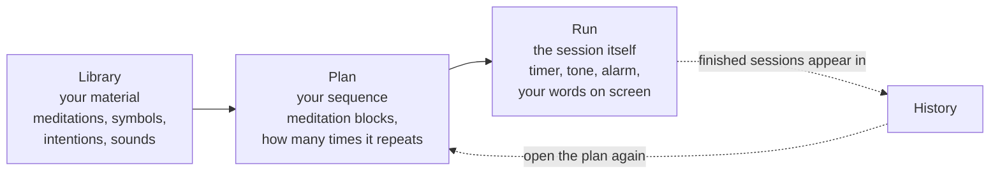

# Meditaur — User Guide

A complete, plain-language guide to Meditaur: what it is, what every screen does,
and how to build and run a meditation session from start to finish.

No technical knowledge is needed. Every button is named exactly as it appears on
screen, in `backticks`, so you can follow along with the app open next to you.

**Where to find it:** https://meditaur-web.vercel.app/ — open it in your browser,
or add it to your home screen so it opens like an app.

---

## Contents

1. [What Meditaur is](#1-what-meditaur-is)
2. [Before you begin](#2-before-you-begin)
3. [The big picture](#3-the-big-picture)
4. [Words you will see](#4-words-you-will-see)
5. [Your first session, in five minutes](#5-your-first-session-in-five-minutes)
6. [Finding your way around](#6-finding-your-way-around)
7. [Building your own plan](#7-building-your-own-plan)
8. [Running a session, in detail](#8-running-a-session-in-detail)
9. [The Library, section by section](#9-the-library-section-by-section)
10. [Binaural beats, in detail](#10-binaural-beats-in-detail)
11. [Spoken intentions](#11-spoken-intentions)
12. [Settings, explained](#12-settings-explained)
13. [Your data: backups and moving devices](#13-your-data-backups-and-moving-devices)
14. [Keyboard shortcuts](#14-keyboard-shortcuts)
15. [Troubleshooting](#15-troubleshooting)
16. [Glossary](#16-glossary)
17. [Not available yet](#17-not-available-yet)

---

## 1. What Meditaur is

Meditaur is a guided-timer app for meditation practice. It does three things:

- **It runs a timed sequence of meditation blocks for you**, so you are not
  watching a clock. You build the sequence once — a *plan* — and then simply sit.
- **It can generate binaural beats** (a low humming tone) that play underneath a
  block, using tone settings you control.
- **It shows you your own material while you sit** — the symbols, lines of
  intention, and tables you have written for each meditation.

Meditaur is a **wellness tool, not a medical device**. It does not diagnose,
treat, or cure anything, and it makes no medical claims. If you have a health
condition — in particular epilepsy, a seizure disorder, a heart condition, or a
hearing condition — talk to a doctor before using binaural beats. Do not use
Meditaur while driving or operating machinery, and stop if you feel unwell or
uncomfortable.

Meditaur contains two words in particular that are used in a very specific way:
**symbol** and **intention**. If you are new, read
[Words you will see](#4-words-you-will-see) before building anything.

---

## 2. Before you begin

| What you need | Why |
| --- | --- |
| **Headphones** | Binaural beats only work with headphones. Each ear needs to hear a slightly different tone. Through a speaker the effect disappears. |
| **A modern browser** | Chrome, Edge, Safari, or Firefox, reasonably up to date. |
| **Sound switched on and turned up** | Your device volume, and the volume controls inside Meditaur. |
| **Volume checked inside the app** | Meditaur starts at about 70% of your maximum output. See [Settings](#12-settings-explained). |
| **A quiet place, 5–15 minutes** | Even a short session works better without interruptions. |

Two practical tips:

- **Browsers do not allow sound until you interact with the page.** Meditaur is
  built around this: audio starts the moment you press `Start` (or the space bar).
  Nothing plays before that. There is nothing wrong if the app is silent until
  you press `Start`.
- **Put your phone on charge for long sessions.** Meditaur asks the browser to keep
  the screen awake while a session is running, but a long session still uses battery.

---

## 3. The big picture

Meditaur has three jobs, and each one has its own area of the app.

- **The Library** is where you keep everything: your meditations, your symbols,
  your lines of intention, your sound presets, your audio files, and your tables.
  It is your content, and it is reusable.
- **The Plan** is the running order. It says: intentions for 2 minutes, symbols
  for 1, focus for 6, then the next meditation — and repeat the whole thing once.
- **The session** is what happens when you press `Start`. Meditaur counts down,
  plays the tone, rings the alarm at the end of each block, and moves to the next
  part by itself.

A useful way to think about it: the Library is the kitchen, the Plan is the
recipe, and a session is cooking the dish.

You can use Meditaur without ever entering the Library. The app arrives
pre-filled with sensible starter content so you can sit immediately — see the
next section.

---

## 4. Words you will see

Meditaur uses a small vocabulary with specific meanings. These are worth five
minutes of your time, because the same words mean slightly different things in
some other meditation apps.

| Word | What it means in Meditaur |
| --- | --- |
| **Meditation** | The place you put your attention. Every chakra, every body point, and everything else you add is a *meditation*. Examples that come with the app: `Third-Eye Chakra`, `Root Chakra`, `Liver`, `Kidneys`, `Protection`, `Thanks Giving`. |
| **Type** | What kind of meditation it is — the row it sits under. The app ships with four: **Chakras**, **Points**, **Protection** and **Thanks Giving**, and you can add your own. A type is a row of its own in the Database, so it gets a tab in the Library, a table in the Database and a group of tiles in the planner. |
| **Symbol** | A drawing or glyph you meditate on *for* a meditation. Symbols live in one shared library, and you attach them to meditations. The app ships with eight examples: `Rama`, `Zonar`, `Halu`, `Harth`, `Gnosa`, `Iava`, `Kriya`, and `Shanti`. One symbol can be attached to many meditations. |
| **Row** | One line of the `Karuna` table: a meditation, a symbol, or a pair of the two. It is what carries the intentions — a row that names a chakra and a symbol is how that symbol is *attached* to that chakra. |
| **Intention** | A short line of text you say or hold in mind. Intentions live inside a row, so a line can belong to a meditation, to a symbol, or to that pair. |
| **Affirmation** | A sentence you write to repeat in your own words. Affirmations and intentions are one table of sentences — the `Affirmations` tab is where every sentence can be seen and edited with what it is associated with. |
| **Column** | Your own extra field on one of the Database's tables. If you want to track something the app does not have a box for — a colour, a note, a reference number — you add a column and it appears on that table's records. |
| **Preset** | A saved binaural sound: the tones in your left ear, the tones in your right ear, the fade in and out, and the EQ. |
| **Display** | A meditation's own list of which of the Database's columns are shown during a session, and which of those stay in place while you scroll. Each meditation in a plan has its own, and a plan's own answer is what an untouched meditation follows. It belongs to the meditation, not to the Database. |
| **Plan** | Your running order: a list of blocks, plus how many times it repeats. |
| **Block** | One step inside a plan: a **meditation block**, which runs one meditation through its stages. |
| **Stage** | A part of a block, with its own length: `Intentions`, then `Symbols`, then `Focus`. A block rings its alarm **once**, at the end of its last stage. |
| **Cycle** | One full pass through every block in the plan. A plan with 16 blocks and 3 cycles runs those 16 blocks three times. |
| **Session** | One complete run of a plan, from the first block to the last. |
| **Master volume** | The overall loudness of everything Meditaur plays. |
| **Alarm volume** | The loudness of the sound that marks the end of a block. |

---

## 5. Your first session, in five minutes

You do not need to create anything. The app arrives ready to use.

1. **Open Meditaur.** You land on the welcome screen, which says `Meditaur`
   and offers two buttons you need: `Start session` and `Open planner`. (There is also
   an `Account` button beside them; you never need it, though it is how your material
   follows you to another device — see [§13](#13-your-data-backups-and-moving-devices).)
2. **Put your headphones on**, and check your device volume.
3. **Press `Start session`.** Meditaur takes the plan you used last (the one that comes
   with the app is called `Chakra circuit`) and opens the run screen.
   - If you see `No plan to start. Open the planner first.`, there is no plan yet —
     open the planner and press `New plan`.
   - If you see `Still starting up. Try again in a moment.`, give it a second and
     press `Start session` again.
4. **Look at what is on screen.** At the top left is `Back`. Beside it is the name
   of the meditation, with its type. Below that is the stage strip — `Intentions`,
   `Symbols`, `Focus` — each with its own minutes and seconds wheels, set to that
   meditation's usual lengths. That strip is also the clock once you begin. Below
   it is your material for the block. Nothing is playing yet.
5. **Set a length if you want a different one** — scroll a wheel, drag it up or
   down, or press it and type a number. See
   [§8.1](#81-what-you-see-before-you-start) for how the wheels work. Before the
   session starts you can change **any** stage's length; once it is running the same
   wheels are the countdown and stop taking edits, so a length is decided before you
   begin. Changing one here changes **this session only**; the meditation's own
   lengths live in `Library → Chakras → Edit` (a type's tab is the one named after
   it — `Chakras`, `Points`, `Protection`, `Thanks Giving`).
6. **Press `Start`** (the large button at the bottom), or press the **space bar**.
   The timer starts counting down, the tone fades in, and your intention lines
   are on screen in front of you.
7. **Meditate.** You do not need to touch anything. When the block ends, the alarm
   sounds, there is a brief pause, and the next block begins on its own.
8. **When the session finishes**, the screen shows `Start another session`, which returns you
   to the planner. The session is now recorded in **Library → History**.

If you want to stop early, press `Stop`, or press the **Escape** key. To move on
without waiting, press the **right arrow** key for the next stage, or `Skip` to
leave this meditation and go to the next block.

The starter plan (`Chakra circuit`) opens and closes with `Thanks Giving` — a
silent block that reads out the affirmations you have written — and runs the seven
chakras between them, in order from `Third-Eye` down to `Root` and on to `Crown`.
Each chakra is three stages: intentions 2:00, symbols 1:00, focus 6:00 — nine
minutes. That is a long session; if you want something shorter for your first
attempt, open the planner and remove blocks or change the stage lengths. The tiles
above the plan can start `Liver`, `Kidneys` or `Protection` on their own, which is
a five-minute or eleven-minute session. See the next sections.

---

## 6. Finding your way around

Meditaur has a welcome screen and five main areas, plus a full-screen run view.

| Screen | What it is for |
| --- | --- |
| **Welcome** (`Start session`, `Open planner`) | The front door. Starts a session or opens the planner. |
| **Plan** | Builds and edits your meditation sequence. |
| **Library** | Browses all your material: one tab per meditation type (Chakras, Points, Protection, Thanks Giving, and any you add), symbols, audio files, presets, plans and history. Reading only — everything you change lives in the Database. |
| **Database** | The whole of your material in tables, and the only place anything is edited. |
| **Run** | The full-screen session itself. |
| **Settings** | Loudness, text size, the voice, and defaults for new plans. |
| **Binaural tuner** | A live laboratory where you adjust tones and hear them immediately. A preset's editor has the same controls under its name, and `/tuner` opens one on its own. |

(The welcome screen also has an `Account` button. You never need it; it is how your
material moves between devices — see [§13](#13-your-data-backups-and-moving-devices).)

**The navigation bar.** On `Plan`, `Library`, `Database` and `Settings` there is a
bar at the
top with a link for each area, and the link for the area you are currently in is
highlighted. Two exceptions:

- The **welcome screen** has no navigation bar.
- The **run screen** has no navigation bar and no other chrome, so that nothing
  distracts you while you sit.

**Getting back.** Every editor screen has a `Back` button in the top-left corner.
Inside the Library, `Back` always returns you one step, and you can press it
repeatedly to get back to the Library home.

**A small quirk worth knowing:** the welcome screen is only reachable at the
app's main address. Nothing inside the app links back to it. If you like starting
there, bookmark it. The run screen's `Start another session` button, and the planner's
`Start session` button, both return you to `Plan`, not to the welcome screen.

---

## 7. Building your own plan

Open `Plan` from the welcome screen (`Open planner`) or from the navigation bar.

### 7.1 What a plan looks like

At the top of `Plan` you will see a row of **focus tiles**, grouped under the
headings `Chakras`, `Points` and `Custom`. Each tile is a small button only as
wide as the name inside it, and they wrap onto as many rows as they need, so a
long list of meditations stays compact. These are shortcuts: tapping one starts
a session immediately, using just that one meditation. They are quick, but they do
not ask for confirmation — see [§7.2](#72-a-warning-about-the-focus-tiles).

Below the tiles is your plan, in this order:

- The **plan tools in one strip** — `Switch plan`, `New plan`, `Duplicate plan`,
  and `Delete plan` when there is more than one plan. The tools sit in their own
  outlined strip, so "what starts a session" and "which plan am I editing" never
  read as one row of buttons.
- The **plan name** in an editable box.
- The **one add action** — `Add meditation block`, which opens a text-filtered
  picker over every meditation of every type. Nothing else sits under the name.
- The **blocks**, as a row of cards you can scroll sideways.
- The **plan-wide settings**: `Cycles`, `Repeat until stopped`, `Auto-advance`,
  `Binaural beats`, and `Alarm`. (`Stop binaural when alarm rings` is a [Settings](#12-settings-explained)
  switch now, not a plan one — one setting, one place.)

`Alarm` decides whether a block's end rings, and **it is off until you turn it on**.
It belongs to the **block**, with the plan's switch as the answer a block inherits —
so one silent Thanks Giving can sit in a circuit whose chakras ring — and the run
screen has the same switch so it can be turned off for one sitting. Each **stage** has
its own two switches beside its timer — `Binaural` and `Auto-scroll` — so a chakra's
intentions can be silent and its focus can carry the tones.
See [§8.1](#81-what-you-see-before-you-start).
- The **buttons at the very bottom**: `Save` and `Start session`. They are the
  same size; `Start session` is the filled one, because starting the run is what
  the page is for.

If there is no plan yet, the page says `No plan` and offers a `New plan` button.
New plans are created with the name `New session`, then `New session 2`, `New session 3`, and
so on.

### 7.2 A warning about the focus tiles

The focus tiles at the top of `Plan` start a session **immediately** when tapped.
There is no "are you sure?" step. If you tap a tile by accident, press `Stop` on
the run screen (or press Escape), and you will be returned to the planner.

### 7.3 Adding your first block

1. Press `Add meditation block`. A picker opens with a text bar; type a few letters
   of a meditation's name and tap it — see
   [§9.12](#912-the-picker-one-text-bar-everywhere). The card appears with that
   meditation on it, and its stages already set from the meditation's type.
2. Press `Edit` on the card. Everything about that one meditation is set in the
   panel it opens — which meditation it is, its stages and their lengths, its
   symbol, its sound and its Display — and it is one press away on the card, so
   the card itself stays short.
3. Inside the editor, press `Change` beside `Meditation` to change which
   meditation this block is about. A picker opens; see
   [§9.12](#912-the-picker-one-text-bar-everywhere) for how to use it. Changing it
   keeps the block's place and gives it that meditation's stages.
4. Set the lengths: one row per stage, each with its own wheels. Those same wheels
   are the clock once the session is running — see
   [§8.1](#81-what-you-see-before-you-start).
5. Press `Done` when you are finished. There is nothing to save: the editor writes
   as you go.

That is already a workable plan: one meditation, three stages, done.

### 7.4 What a card shows, and where everything else lives

A card is deliberately short — four things, and nothing else:

| On the card | What it does |
| --- | --- |
| The meditation's name, with its **type** under it | It says what the block is: `Root Chakra` over `Chakras`, or `Thanks Giving` when the block is a thanks-giving one. It reads `Choose` until a meditation is picked. It is also the card's **drag handle** — drag it sideways to reorder the plan, see [§7.6](#76-reordering-duplicating-and-removing-blocks). |
| One line under the name | What the block runs: how long it is, how many stages that is, and the symbol it walks. It is a caption, not a control. |
| A press on the card itself | Opens that meditation's editor. Almost the whole card is this press; only the handle and the two buttons are not. |
| `Edit`, `Remove` | The card's own two buttons, together on its bottom line. `Remove` takes two presses — the first fills it and makes it read `Remove?` — see [§9.11](#911-deleting-rules-the-two-press-and-the-five-second-window). |

Everything a card used to show as read-only text — which meditation it is, the
symbol, the binaural and ambient sounds, the alarm, and a row of wheels per stage —
is written in that editor instead, because there it can be changed rather than only
read. The sections of the editor are:

| Section | What you decide there |
| --- | --- |
| `Meditation` | Which meditation this block is about, with `Change` opening the picker. |
| `Stages` | One row per stage: its length wheels, its `Binaural` switch, and `Auto-scroll` on the two kinds that scroll. |
| `Symbol` | What you will look at: `Rotate next`, `All symbols`, one symbol by name, or `None` (see [§7.5](#75-choosing-a-symbol)). Hidden entirely when the meditation has no symbol rows. |
| `Sound` | The block's `Binaural`, its `Ambient`, and its `Alarm` with the alarm's sound (see [§7.9](#79-the-sound-of-a-block)). |
| `Display` | Which of the Database's columns this meditation shows during a session (see [§7.10](#710-the-display-panel-what-a-session-shows)). |

Every card is the same width, and the strip scrolls sideways, so the row never
wraps into a pile of cards. A value longer than the card is shortened with an
ellipsis (`Third-Eye Chakra` fits; an unusually long asset name does not); the
editor always shows the full value.

### 7.5 Choosing a symbol

Tapping the `Symbol` field opens a small menu with three kinds of choice:

- **`Rotate next`** — Meditaur walks through the symbols attached to this focus
  point, one per block. If you have three symbols attached and three focus blocks
  for that point in your plan, you will see the first, then the second, then the
  third.
- **`All symbols`** — the whole sheet. Every symbol attached to the meditation
  is shown together, in one long list.
- **A single symbol by name** — only that one symbol is shown.

Only symbols that are attached to the chosen meditation appear in this list. If
the list looks short or empty, the meditation needs symbols attached to it —
that is done in the Database, with a row that names both (see
[§9.3](#93-the-database)).

### 7.6 Reordering, duplicating and removing blocks

- **Reorder:** drag a card by its name. The card starts moving as soon as the
  pointer moves a few pixels — there is nothing to hold still for. The other cards
  move out of your way. A card only ever moves sideways: the row scrolls
  horizontally, never vertically, so a card can never drift out of the row.
- **Remove:** press `Remove` on the card. It arms itself and asks `Remove?` on the
  first press, and the second press removes the card — see
  [§9.11](#911-deleting-rules-the-two-press-and-the-five-second-window).
- **Add:** `Add meditation block` adds a card at the end.

### 7.7 Repeats: cycles and "repeat until stopped"

These two controls decide how long the whole sequence runs.

| Control | What it does |
| --- | --- |
| `Cycles` | How many times the entire block list repeats. Use the + and − buttons to set a number from 1 to 99. One cycle means play the blocks once and finish. |
| `Repeat until stopped` | Ignores `Cycles` and repeats the blocks forever, until you press `Stop` (or Escape). Use this for open-ended practice. |

The run screen tells you which cycle you are in — the label beside `Back` reads
`Root Chakra · cycle 2` when the second pass begins.

### 7.8 Auto-advance

`Auto-advance` decides what happens when a block's timer reaches zero:

- **On** — the alarm sounds and Meditaur moves to the next block by itself, after
  a short pause. This is the hands-off mode: you press `Start` once and sit.
- **Off** — the alarm sounds and the timer stops. Nothing moves until you press
  `Skip` (or the right arrow key). This is useful when you want to sit for as
  long as each block needs, and move on when you feel ready.

### 7.9 The sound of a block

Each block can have up to three sounds, and all three are set in that block's
editor — press `Edit` on the card, then look at its `Sound` section:

- **`Binaural`** — the generated tone that plays *during* the block. Pick a
  preset, or `None` for silence. This is the hum you sit inside.
- **`Ambient`** — an audio file (rain, a recording, a track) that plays during the
  block, looping until the block ends.
- **`Alarm`** — the sound that marks the end of the block. `Beep` is Meditaur's
  built-in short tone; anything else is one of your own uploaded files.

Ambient and alarm files are added in the Library, under `Audio files`. See
[§9.5](#95-audio-files).

### 7.10 The Display panel: what a session shows

`Display` is part of the meditation's editor — press `Edit` on the card, then scroll
to its `Display` section. It is where you decide what the **run screen** shows while
you meditate with that meditation. It lists the Database's columns, grouped by the
table they belong to — `Meditation`, `Symbol`, and `Entries` (the pair) — and every
column has two switches, under the two headings that name them:

| Heading | The switch under it |
| --- | --- |
| `Shown` | Whether that column appears in the session at all. |
| `Pin` | Whether it stays at the top of its panel while the panel's other columns scroll under it. A pinned column sits with the chakra's or the symbol's name. |

A column cannot be pinned while it is hidden: pressing `Pin` on a hidden column
shows it, so there is no invisible pin you cannot see.

The settings belong to **this block**, not to the Database and not to the plan as a
whole: each meditation in a plan carries its own answer, so a quiet Thanks Giving
can show two columns while the chakras beside it show eight. There is no plan-wide
Display panel any more — the block you are editing is the one you are deciding for.
Changing a switch here is what gives this meditation its own Display; if you would
rather it followed the plan again, the `Use the plan's Display` button on the
section's heading line hands it back.

The columns you can choose are the ones the Database has: `Name`, `Location`,
`Description` and `Usage` are built in, and every column you added yourself
([§9.7](#97-your-own-columns)) is offered the moment it exists, with nothing to
register. A column you delete simply stops being offered. A column you *hide in the
grid* ([§9.3](#93-the-database)) is a different thing, and is still offered here.

The block's Display is saved with the plan, and the editor writes as you go, so
there is nothing extra to press.

### 7.11 The plan-wide sound switches

At the bottom of `Plan` are two switches that apply to the whole plan:

| Switch | What it does |
| --- | --- |
| `Binaural beats` | The master switch for tone. Turned **off**, no block in this plan plays binaural tone, no matter what each block says. Turned **on**, each block decides for itself. |
| `Auto-advance` | The same setting described in [§7.8](#78-auto-advance), shown here so you can set it for the whole plan. |

`Stop binaural when alarm rings` used to sit here as well. It is a
[Settings](#12-settings-explained) switch now — one setting, one place — and it
is the one a session obeys.

There is a fourth, subtler switch on each *meditation* in the Library, which can
also silence tone for that meditation alone. See
[§10.6](#106-the-two-onoff-switches).

### 7.12 Saving, switching, and copying plans

| Button | What it does |
| --- | --- |
| `Save` | Saves your work. While there are unsaved changes it reads `Save · unsaved`. |
| `Start session` | Saves, then **starts the run** with this plan. This is the normal way to begin a planned session. |
| `Switch plan` | Opens the list of all your plans so you can move to a different one. |
| `New plan` | Creates a fresh, empty plan named `New session`. |
| `Duplicate plan` | Makes a copy of the current plan, called `<name> copy`, and switches to it. Handy for variations: copy, then change the durations. |
| `Delete plan` | Deletes the current plan after a two-press confirmation (see [§9.11](#911-deleting-rules-and-the-two-press-safety)). It only appears when you have more than one plan, and Meditaur refuses to delete your very last plan with the message `Keep at least one plan`. |

**You rarely need to press `Save`.** Meditaur saves your plan automatically about
half a second after you stop changing something, and again when you leave the
page. `Save · unsaved` is just a reassurance indicator — it will clear itself.

If you have the same plan open in two browser tabs and edit in both, one of them
shows `Plan was changed in another tab`. Reload the page to pick up the newest
version.

---

## 8. Running a session, in detail

The run screen is deliberately bare: no navigation bar, no menus, just the timer
and your material. This is the screen you will spend your practice on.

### 8.1 What you see before you start

From top to bottom:

1. **`Back`**, at the top left. It returns you to the planner — and it ends the
   session, so do not use it to pause.
2. The **name of the meditation** you are on, with the block's stages under it. If
   the plan repeats more than once, the label says which repeat you are in
   (`Root Chakra · cycle 2 of 3`); a single-cycle session says nothing, because
   there is no second cycle to speak of.
3. **The stage strip** — one row of the block's stages (`Intentions`, `Symbols`,
   `Focus`), each with two wheels, minutes and seconds, sharing one highlighted
   band. **This strip is the clock.** Each stage shows its own remaining time in
   the same wheels you set it with, so there is no separate total timer above it,
   and the strip wraps onto as many lines as the stages need.
   Before the session starts, every stage's wheels are editable, and turning them
   sets how long that stage runs. Turn a wheel with the **scroll wheel** of a mouse
   or with a trackpad, or **drag it up to increase** and **down to decrease**; the
   neighbouring numbers stay visible above and below it, and the minutes and seconds
   always line up. **Press a wheel without moving** and it becomes a box you can
   type a number into; `Enter` accepts it, `Escape` puts the old number back, and
   anything that is not a number changes nothing. The arrow keys,
   `PageUp`/`PageDown` and `Home`/`End` work too when a wheel has keyboard focus.
   **Once `Start` is pressed, the same wheels become the countdown and stop taking
   edits** — they stay where they were and only the numbers change, so what you set
   is always in the place you set it, even after a stage is restarted. Each stage
   also carries a `♪` beside its name, which is that stage's **binaural switch**, and
   a small `↺` underneath it that restarts that stage from its own length; at the end
   of the strip, `↺ Restart` restarts the whole meditation from its first stage.
   This is the round-up of the whole quick-session idea: tap a chakra on `Plan`, set
   the lengths and the switches you actually want, press `Start`.
4. **Three regions side by side**, which are what a session is actually made of
   (a phone stacks them; a wider screen puts them in a row):
   - **The meditation** — your meditation's name, the **type** it belongs to under
     it (`Chakras`, `Protection`), and the columns the plan's
     [Display](#710-the-display-panel-what-a-session-shows) shows for that
     meditation. A column you hide there is gone from here too.
   - **The symbol** — the symbol you are currently reading: its picture (if you
     uploaded one), its name, and the Display's columns for it. It **updates by
     itself** as the intentions below move from one symbol's lines to the next, so
     you always see the symbol whose lines are in front of you.
   - **The intentions** — one column holding every line of the block in order: the
     meditation's own lines first, then each symbol's. It is the only thing on this
     screen that scrolls, and it **scrolls itself** at the pace of the timer, so the
     last line arrives as the stage's clock runs out. A stage too short for its
     lines does not scroll at all. If you are reading by hand, touching the column
     takes over from there.
   A **Thanks Giving** block shows your affirmations in that column instead of
   intentions, because those are what it reads.
5. The **control bar**, pinned to the bottom: `Start` before you begin, then
   `Pause` / `Resume`, `Skip` and `Stop` once it is running, with the run screen's
   own switches beside them. `Alarm` is the switch for the meditation on screen: it
   turns that block's ring on or off for this run **without changing the plan**, so
   the next session starts from the plan's own answer. `Auto-scroll` appears beside
   it when the stage on screen is one that scrolls, and `Auto-advance` when there is
   a next stage for it to act on, so a switch that cannot do anything is never drawn.
7. A **keyboard legend** on wide screens, drawn as keys rather than as a
   sentence, and it only lists the keys that do something right now:

| Shown | When | What it does |
| --- | --- | --- |
| `Space` `start` | before you begin | Starts the session — the same as pressing `Start`. |
| `Space` `pause` | while it runs | Pauses; presses again to resume. |
| `→` `next stage · twice: next meditation` | while it runs | Once moves to the next stage; twice in quick succession moves to the next meditation. It is **not** offered before you start, because there is nothing to move to yet. |
| `←` `restart stage · twice: previous · thrice: previous meditation` | while it runs | Once restarts the stage you are in; twice steps back a stage; three times steps back a meditation. |
| `Esc` `end the session` | always | Ends the session and returns you to the planner. |

A key that moves you — `→` or `←` — clears the clock and holds the session there:
the tone stops and `Start` returns, so nothing begins until you say so. The same is
true of pressing a stage in the strip or its `↺`.

Nothing plays until you press `Start`.

### 8.2 Starting

Press `Start`, or press the **space bar**. Meditaur will:

- Check that no session is already running in another browser tab.
- Ask the browser to keep your screen awake (where the browser supports it).
- Wake up the audio, fade in your binaural tone, and begin block one at 0:00 of
  the countdown.

If you see `A session is already running in another tab`, you have Meditaur open
somewhere else with a session in progress. Close or stop that one first.

### 8.3 During a session

Nothing needs your attention. The countdown runs, the tone plays under it, the
alarm marks the end of each block, and the next block begins by itself when
`Auto-advance` is on. The meditation, the symbol in play and the intentions stay on
screen for the whole block: the symbol changes by itself as the intentions move from
one symbol's lines to the next, and the intentions column scrolls at the pace of the
stage you are in. If you scroll it by hand, it carries on from where you left it.

A reader whose device asks for **less motion** gets a still column: the stage's own
`Auto-scroll` switch is then the way to ask for it (see
[§10.6](#106-the-two-onoff-switches) for the switches).

**Where you are is the strip.** Each stage's wheels are showing that stage's own
remaining time, so a glance at the strip answers "how long is left" and "which stage
is this". A stage that is already behind shows `0:00`, and the stages still ahead
show their full length. If a session has more minutes than you expected, the total
is the sum of what the strip shows — there is no second number anywhere to compare
against.

**Pressing a stage holds the session there.** Press any stage's name, or its `↺`,
and Meditaur sets that stage back to its full length and waits: the tone stops and
`Start` comes back, so the session then runs on from that stage. It is the way to
repeat a stage you were not ready for, and the same thing happens if you press `←`

### 8.4 Keys and buttons

| What you press | What happens |
| --- | --- |
| **`Start`** or **space bar** | Begins the session. |
| **space bar** while running | Pauses. |
| **space bar** while paused | Resumes. |
| **`Pause`** | Pauses. The tone stops and the timer holds where it is. |
| **`Resume`** | Continues from exactly where you paused. |
| **`Skip`** | Ends the whole block immediately and moves to the next one. No alarm is played. |
| **right arrow** | Moves on: once for the next **stage**, twice within two seconds for the next meditation. The clock is cleared and the session holds until you press `Start`. |
| **left arrow** | Once restarts the stage you are in, twice steps back a stage, three times steps back a meditation. Same rule: the clock is cleared and nothing starts on its own. |
| **`Stop`** or **Escape** | Ends the whole session and returns you to the planner. |
| **`Auto-advance`** | A switch on the run screen too. Changing it here affects only the current session — it does not change the plan itself. |
| **`Start another session`** | Appears once the session is finished. Returns you to the planner so you can choose or build another one. |

The legend at the bottom of the screen lists the keys that work at that moment,
drawn as keys: `Space` `start` or `pause`, `→` `next stage` (twice for the next
meditation), `←` `restart stage` (twice for the previous stage, three times for the
previous meditation), and `Esc` `end the session`. Every one of those movement keys
leaves the session held with the clock cleared, waiting for `Start`.

Keyboard shortcuts work on a computer. On a phone or tablet, use the on-screen
buttons.

### 8.5 What happens at the end of a block

1. The block's alarm plays — your chosen file, or the built-in `Beep`.
2. Depending on the `Stop binaural when alarm rings` switch in `Settings`, the
   tone either fades out completely, or drops to a quiet background level.
3. If `Auto-advance` is on, Meditaur waits for the alarm to finish (a moment, for
   the built-in beep; longer for a longer file) and then starts the next block.
   If `Auto-advance` is off, the app waits for you to press `Skip`.

### 8.6 Finishing, stopping early, and starting over

- **Finishing** the last block ends the session. The tone fades out, the screen
  shows `Start another session`, and the session is written into
  **Library → `History`**.
- **Stopping early** — `Stop` or Escape — ends the session with no alarm, and does
  **not** record anything in History. History only counts sessions you completed.
- **Reloading the page** or closing the tab during a session ends it. When you
  come back, the run screen will offer `Start` again from the **beginning** of the
  plan; Meditaur cannot resume a session part-way after a reload.
- **Changing what is on screen** — leaving the run screen, locking your phone, or
  switching to another app may also interrupt the audio, depending on your
  device. For best results, leave the run screen open.

### 8.7 Keeping the screen awake

While a session is running, Meditaur asks the browser to keep the screen on. Most
browsers cooperate, but they can also take that permission back (for example if
you switch to another app, or if your device has a strict battery-saving mode).
If your screen keeps going dark mid-session, turn off or extend your device's screen
timeout in your device settings.

### 8.8 One session at a time

Meditaur allows a single session at a time per browser. If a run is already going
and you press `Start session` again from another tab — in the planner or on the
welcome screen — the first run keeps running, and the second request simply
returns you to it. Pressing `Start` in a second tab gives you `A session is
already running in another tab`.

---

## 9. The Library, section by section

The Library is the largest area of the app, because it holds all your material.
Open it from the navigation bar.

At the top of the Library you will find:

- **The section tabs**, one per area of the Library: `Meditations`, `Symbols`,
  `Database`, `Archive`, `Audio files`, `Presets`, `Plans`, `History`. The tab that
  is lit up is the section you are in, so the page repeats no title of its own.
- **`Download catalog`** and **`Restore catalog`** — the whole-library backup and
  transfer tools. See [§13](#13-your-data-backups-and-moving-devices).
- The section's **`Add …` action**, and — in the two sections that have both —
  the **`Table`** switch with **`Columns`** beside it. See
  [§9.10](#910-cards-and-the-table-view).

The Library remembers which tab you were last in for the current browser tab, so
a refresh brings you back to the same section. A brand-new tab starts at the top.

**Two halves, and only one of them writes.** `Meditations`, `Symbols`,
`Audio files`, `Presets`, `Plans` and `History` **show** your material: pressing a
card opens that entry's page, and the page has no boxes to type in. Everything
that changes something — a chakra, a symbol, a line, a column — happens in the
**Database**, which is the fourth tab and the one screen here that holds a draft
([§9.3](#93-the-database)). Leaving a page is `Back` or **Escape**; on a page that
only shows, both do the same thing.

### 9.1 Meditations

A meditation is a place you put your attention: a chakra, a body point, or
something entirely your own.

The list shows each meditation with its picture (or `No image`), its name, its
type and location, and how many rows it has in the [Karuna
table](#93-the-database) — that is how many symbols are attached to it.
**Pressing a card — or anywhere on a row, in table view — opens that meditation's
page**, and the page itself is read-only:

| On the page | What it does |
| --- | --- |
| `Edit` (bottom bar) | Opens this meditation in the Database's record view, where everything about it is changed. |

There is no `Edit` or `Delete` on the card itself: what opens only shows, and
editing means the Database.

**Adding a meditation**

`Add meditation` opens the Database's **new-record screen**, which is the same
form `Edit` opens. Fill it in and press `Save`:

1. Choose a type: `Chakras`, `Points`, `Protection` or `Thanks Giving` — or a type you added yourself.
2. Give it a `Name`.
3. Optionally add a `Location` in words — for example `Between the eyebrows`.
4. Set the meditation's own stage lengths — one row per stage, with `Minutes` and
   `Seconds` wheels — if it should not follow its type's own template. This is what
   a new block of this meditation is built from.
5. Optionally set a `Default sound` — the binaural preset this meditation uses by
   default. When you later pick this meditation in the planner, this sound and
   this duration are copied onto the block for you.
6. If you chose **Chakra**, extra boxes appear: `Description`, `Governs`,
   `Colour`, `Element`, a `Representation` image, and `Representation
   description`. These are for the traditional chakra correspondences.
7. Press `Save`. You land back on the list, with the new meditation among the
   others.

**The meditation page shows; it does not change anything.** Opening a meditation
gives you its chakra block, its custom field values — each one under its own
heading — the rows of `Karuna` that name it, and its binaural state.
Nothing you can press changes the meditation by accident. `Edit` in the bottom
bar opens it in the Database's record view, and that record view is where
everything else about it lives: its name, type, location, duration and picture,
the columns of its own table, and the `Open binaural config` screen. Lines and
symbols are not edited here at all — they are rows of the [Karuna
table](#93-the-database), where a row is the meditation, the symbol, or the pair, and
the lines inside it are that pair's intentions.

**Deleting a meditation happens in the Archive.** Archiving it from the Database
hides it, its rows, their lines and any plan block that used it, and **Restore**
brings all of it back; a permanent delete is offered on the [Archive
page](#94-the-archive), and its sentence names the rows, the lines and the plan
blocks it takes with it.

### 9.2 Symbols

Symbols are the drawings or glyphs you meditate on. They live in one shared
library, and you attach them to meditations.

Press `Add symbol` to create one. **Pressing a symbol's card — or its row, in
table view — opens that symbol's own page**: its picture, description, usage, your
custom field values under their own headings, and the meditations it is attached
to. Like a meditation's page, it only shows; `Edit` in the bottom bar opens it in
the Database's record view. Each symbol has:

| Box | What it is for |
| --- | --- |
| `Name` | What the symbol is called. |
| `Image` | The symbol's picture. Press it to upload a file. |
| `Description` | A short summary — what the symbol is for, in one or two lines. |
| `Usage` | How to practise with it. This is the longer text. |
| Heading line of each field | Your own box for this symbol, because a column of the Symbols table can be any [type](#97-your-own-columns) you like. Any column you added to the Symbols table appears here, under its own heading. |

Press `Save` when done. **Deleting a symbol** is offered on the [Archive
page](#94-the-archive); its sentence names the rows that named it, the lines those
rows held, and the plan blocks that stop showing when it goes. Archiving instead
hides all of that and `Restore` brings it back.

Images: PNG, JPEG, WebP and GIF are accepted, up to 2 MB each. Transparent-background
images look best — the app frames every image softly so that pictures with a white
background do not look out of place. A symbol's picture also appears beside its
name on the run screen, next to its intention lines.

### 9.3 The Database

`Database`, the tab between `Library` and `Settings` in the bar at the top, is the
whole of your material in tables, and it is where anything is edited:

| Table | What a row is |
| --- | --- |
| `Karuna` | One **row**: a meditation, a symbol, or a pair of the two. This is the table your intentions live in — a line is written inside the row it belongs to. Each group is headed by the meditation you are looking at, and the selector at the top searches the meditations that have symbol rows. |
| one per type | `Chakras`, `Points`, `Protection`, `Thanks Giving`, and a table for every type you add. A row is one meditation of that type, with its own columns. |
| `Symbols` | One symbol, with its own columns. |
| `Presets` | One binaural sound, with its own columns. |
| `Affirmations` | One **sentence**: an intention or an affirmation. This is the one place every sentence can be seen, with an `Association` cell saying what it is written about; a sentence with nothing associated with it yet is an orphan, waiting here until you attach one. It is not a table of its own any more — intentions and affirmations are one table, and this is its widest view. |
| `Types` | One type: its name, and where it sits in the tabs and in the tiles. Adding a row here gives the type a tab in the Library, a table here and a group of tiles in the planner, with nothing else to set up. |

The switcher remembers which table you were on for the rest of the browser tab.

**The screen holds a draft.** Everything you do here — a cell, a new row, a
reordered line, a new column, a renamed chakra — appears at once but is only
written when you press **`Save`** in the bottom bar, which is dim until there is
something to write and says `Unsaved changes` beside it when there is. **Leaving
loses unsaved edits**, which is the one place in Meditaur where that is true, so
leaving with edits asks first: a question in the app when you press `Back` or
`Escape`, and the browser's own warning if you close or reload the tab. `Save`
then reports what it did, including the rows it put in the Archive because they
had nothing left to point at.

**Rows and lines are dragged.** Every row has a grip (`⣿`) at its left and a small
`↑`/`↓` beside it; every line has the same. Dragging onto another row moves it to
that place, and the order is written immediately — nothing animates into place.

**The `+` signs insert where you press them.** The `+` on a row's own cell puts a
new row in that row's place; the one at the right end of a table appends. `＋ Add`
under a row's lines writes another line. On a phone the row's lines open in a
panel below the row instead of stretching it, with the same handles.

**Each column has its own filter.** Every heading carries a small `⌕`; pressing it opens a
box under that heading, and a second press closes it. What you type narrows the table to the
rows that column contains it — so a chakra can be found by its name, a symbol by its usage, an
intention by a word inside it. Two things the box understands beyond plain text:

- `|` is "or", inside one column: `love|compassion` shows rows with either word.
- A **regular expression** is read as one, case-insensitively — `^I am` for "starts with",
  `heal(s|ing)` for either ending. A pattern the app cannot read is treated as ordinary text
  rather than hiding everything, so a typo costs you nothing.

Open filters on **several columns** at once narrow the table further, not wider: a row has to
match every one of them. `Escape` inside a box closes that box — it does not take you out of
the Database. The toolbar says how many filters are narrowing the table, and switching tables
clears them: a filter is a way of looking, not a setting. A filter that matches nothing leaves
the table empty above its `New …` row rather than explaining itself.

**`Edit table` hides columns you do not want to look at.** Press it and every
heading grows a small `✕`; pressing one takes that column out of this table's view.
It is a hide, not a delete: the column, its values and its place in a meditation's
Display all stay, and pressing `Edit table` again puts it back. While it is on and something
is hidden, a `Show N hidden column(s)` button appears beside it to bring them all
back. Columns cannot be reordered. Hiding is remembered per table **for this browser
session only** — reload the tab and every column is back.

**A cell is a box, a chip or a wheel, depending on the column's type.** Text,
long text, number, duration (the same wheels as everywhere), date, image,
`reference` and `select`:

| Cell | How it works |
| --- | --- |
| Text, number, long text | A box. `Enter` commits, and so does clicking away; `Escape` puts the box back to what it held. Nothing is written until `Save`. |
| Duration | The alarm-clock wheels, the same control the planner uses. |
| Image | A framed picture; press it to upload or replace one. |
| Reference | A chip naming the record it points at. Press the chip for `Open record` and `✕ Clear`; press `▾` for the search bar. |
| Select | The same chip, over that column's own list of options. Typing a name that is not on the list offers `Add “…”` to make it one. |
| Lines | The row's intentions: each with a grip and an `X`, and `＋ Add` underneath. |

**A name the search bar cannot find can be made on the spot.** Type `Nova` into a
symbol chip and press Enter: Meditaur offers to create the symbol, makes it, and
chooses it for the cell — the same for a chakra or a preset.

**Your own columns** are added with the `+` at the end of a table's header row:
give it a `Heading`, a `Description` and a `Type`, and it is usable immediately —
in the grid, on the record's page in the Library, and in every meditation's Display
([§7.10](#710-the-display-panel-what-a-session-shows)). Two columns arrive with
the app on the Chakra table: `Governs` and `Element`. A column can be removed
with its `X` **only while it is empty** — the control is not drawn once it holds
a value — and removing one takes the values that were typed in it.

**Adding to one of the other tables** works the same way, with `Open` on a row
opening that record's own page. `Add meditation`, `Add symbol` and `Add preset`
in the Library open the same screen for a brand new record.

**A note about the lines that come with the app.** The starter set is a real
practitioner's own material, and some lines contain blank markers like `<>` where
a name or detail belongs. These are examples, not prescriptions — read through
them and replace them with your own words. Your practice works better with lines
you have written yourself.

### 9.4 The Archive

Nothing you archive is deleted. The `Archive` tab lists everything that has
stepped aside — chakras, symbols, presets, rows and single lines — **most recently
archived first**, grouped into Records, Rows and Lines, with what each one was
attached to and when it was archived. Each entry has two actions:

| Action | What it does |
| --- | --- |
| `Restore` | Puts it back exactly as it was. Nothing about it was moved or copied, so its lines, its values and its place in a plan all return with it. |
| `Delete` | The **only** permanent delete in Meditaur. Press it once and it says what goes with it — the rows, the lines, and the plan blocks that will stop existing — and press again to do it. |

Archiving is reached from the Database: the `X` beside a row, a line's `X`, or the
`×` on a record's row opens the little box that offers **Archive** on one press
and **Remove** on two.

If nothing has been archived yet, the page says so: *Nothing archived — items you
archive appear here.*

### 9.5 Audio files

This is where you add your own sounds. The section has two lists: `Ambient`
(background audio that plays during a block) and `Alarm` (the sound that marks
the end of a block).

Press `Add ambient file` or `Add alarm file` and choose a file from your device.
Meditaur records the file's length and lists it with its name and duration. Once
added, a file becomes selectable in any block's editor in the planner, under
`Sound`.

Rules to know:

- **Audio files** up to 10 MB. MP3, WAV, OGG, WebM, MP4/M4A, AAC and FLAC are
  accepted. The file must be one your browser can actually play, otherwise
  Meditaur says the file type is not supported.
- **Images** (for symbols and chakra representations) up to 2 MB. PNG, JPEG, WebP
  and GIF.
- **Deleting** a file clears the references to it rather than refusing: a plan
  block that used it as its `Ambient:` or `Alarm:` sound keeps its place and loses
  the sound, and a chakra representation image leaves its meditation with no
  picture. The armed button tells you how many places were cleared.

### 9.6 Presets

A preset is a saved binaural sound. The `Presets` section lists them with their
left- and right-ear tone counts. The app arrives with twenty examples, based on
Solfeggio frequencies and on 432 Hz tuning, one for each of the starter focus
points.

Press `Add preset` to make one, or `Edit` on a card to open an existing one.

**The preset editor holds the sound itself** — the name, then the tones, the
fades and the EQ right below it, which is the [tuner](#104-the-binaural-tuner)'s
controls on the page instead of behind another screen. There is nothing to open:
the sound is here.

| Control | What it does |
| --- | --- |
| `Name` | The preset's name. |
| `Left ear` / `Right ear` | Which ear you are editing. |
| `Add tone`, `Add beat pair` | Adds a tone, or a classic left/right pair, to that ear. |
| `Hz` / `Gain` | The frequency and loudness of one tone. |
| `Remove tone` | Removes that tone. |
| `Fade in ms` / `Fade out ms` | How long the sound takes to arrive and to leave. |
| `Link EQ ears` | Keeps both ears' equaliser in step. |
| Ten EQ bands | From `32 Hz` to `16000 Hz`, ±12 dB. |
| `Save` | Writes your changes. Unlike the tuner, this screen does not save as you go. |
| `Delete preset` | Removes the preset. Blocks that used it lose their sound and keep their place; a meditation that used it as its default loses the default. |

Each card in the list carries `Duplicate` beside `Edit`, so you can copy a sound
without opening it first: `Duplicate` makes a copy called `<name> copy`, so you
can vary a sound without losing the original.

To hear a sound while you work on it, use the [tuner](#104-the-binaural-tuner),
or a meditation's `Open binaural config`, which adds a `Try` button and a draft
you can throw away.

A preset is removed with its references cleared — see §9.11 — but **your last
preset is protected** (`Keep at least one preset`): a workspace always keeps one
sound.

### 9.7 Your own columns

A column is one field of one table. Adding one does not wait for the app to grow a
box — you decide what it is for, and it works everywhere at once.

Add one from the Database with the `+` at the end of a table's header row (or on a
header, to insert it before that column). The form asks for:

| Box | What it is for |
| --- | --- |
| `Heading` | The word you will see, in plain words. For example `Colour`. It names the column in the grid, the box on the record's page, and — if you switch it on — the fact shown during a session. |
| `Description` | A line saying what the column is for. Optional. |
| `Type` | What a cell holds: `Text`, `Long text`, `Number`, `Duration`, `Date`, `Image`, `Reference` or `Select`. A reference points at another record — a chakra, a symbol or a preset — and a select has a list of options you fill in yourself. |

A column belongs to the table you added it to, so `Governs` on a chakra and
`Governs` on a symbol are two different columns. **Remove** a column with its `X`
**only while it is empty** — once it holds a value the control is not drawn — and
removing one takes the values that were typed into it. The armed press says how
many values go with it. (To take a column that *does* hold values out of your way
without losing anything, use `Edit table` instead — it hides a column from the grid
for this browser session and leaves the data alone: [§9.3](#93-the-database).)

To choose which columns a **session** shows, use the `Display` section of a
meditation's editor on the plan screen: [§7.10](#710-the-display-panel-what-a-session-shows).

### 9.8 Plans

This section is a simple list of every plan you have. Press a plan's name to open
it in the planner. This is the easiest way to jump between plans, and it is also
where you will notice any plan Meditaur created for you automatically — for
example, single-focus sessions created from the focus tiles appear here as
`Focus session`.

### 9.9 History

History is your log of **completed** sessions. At the top it shows
`Sessions completed this week:`, followed by a number, counting from Monday.
Below that, each completed session is listed with the plan's name, how long it
ran, and when you finished.

If you have not finished a session yet, the section reads `No completed sessions
yet.`

What counts and what does not:

- **Counts:** sessions you run all the way to the end.
- **Does not count:** sessions you `Stop` or end with Escape, blocks you `Skip`,
  and sessions interrupted by closing the tab or reloading.

Meditaur keeps the most recent 50 sessions per device. Older entries drop off the
list automatically. Deleting a plan also removes that plan's history entries.

### 9.10 Cards and the table view

Two sections — `Meditations` and `Symbols` — can be shown either as **cards** or
as a **table**, and the section header carries one switch for it:

- **`Table` off** — the section shows **cards**: each entry is a block with its
  image, name and a line or two of detail. A card carries no `Edit` and no
  `Delete`: these pages only show ([§9.1](#91-meditations)).
- **`Table` on** — the same entries as rows, like a spreadsheet, and the
  **`Columns`** action appears beside the switch. Press `Columns` to open a panel
  of switches, one per available column, so you can turn individual columns on and
  off. While that panel is open the `Columns` button stays selected, so you can
  see it is the one you pressed.

**Pressing an entry is how you open it** — anywhere on the card, or anywhere on a
row. That opens the entry's own page: it shows you what the entry is, and `Edit` on
that page turns it into the form where you change it.

The other sections — `Audio files`, `Presets`, `Plans` and `History` — list their
entries as cards. The audio and preset cards carry their own actions (`Delete`, and
`Duplicate` for presets), because those things have no page of their own to hold
them.

Meditaur remembers your choice per section, and remembers which columns you
switched on. Switch back to cards any time; nothing is lost.

### 9.11 Deleting: rules, the two-press, and the five-second window

Meditaur never deletes your material silently. Two rules apply everywhere:

**1. A two-press confirmation with a five-second window.** When you press a
delete button, it does not delete. Instead it arms itself, fills with a light
red, and changes its label to include a question mark — `Delete` becomes
`Delete Heart Chakra?`. Pressing it again fills it dark red as it goes and the
item is deleted. If you do nothing, the button puts itself back after **five
seconds**, so a half-pressed delete cannot sit there waiting for a stray tap.
Pressing anything else cancels it at once.

This is every delete in the app — records and rows on the Archive page, columns in
the Database, presets, audio files, plans, and a plan's blocks. **Archiving is
not one of them**: archiving is a single press, and it is the safety net that
stands in for an undo. The one other exception is `Remove tone` in the tuner and
in a meditation's binaural page: that edits a draft you have not saved, and the
`Revert` button beside it is the undo.

**2. Whatever else goes is named first.** Meditaur removes references rather than
refusing, so the armed button — and the box the `X` on a row opens — tells you
what the action would take with it:

| Sentence | What it means |
| --- | --- |
| `This also removes 2 plan blocks, 1 row and 3 intentions.` | These things stop existing. The count covers plan blocks, rows, intention lines and column values. |
| `1 place that pointed at it is cleared.` | These things stay, but lose what they pointed at — a plan block keeps its place and falls back to `Rotate next`, or a block loses its ambient sound. |

Nothing is listed when nothing else is affected. There is no undo, so read that
line before the second press.

Only two deletes still refuse outright, and each says why:

| Message | What to do |
| --- | --- |
| `Keep at least one plan` | A workspace must always have at least one plan. Create a new one first. |
| `Keep at least one preset` | A workspace always keeps one binaural sound. Add another preset first. |

The old `Keep at least one table view` went with the Views tab: a plan stores its
own display now, so there is no last view to protect.

There is no undo anywhere in Meditaur. If you are about to do something
significant, press `Download catalog` first — that backup is your safety net.

### 9.12 Choosing a value: the chips and their search bars

In the Database, a reference or a select is a **chip**, and there are two gestures
on it:

| Gesture | What it does |
| --- | --- |
| The chip itself | Opens `Open record` — for the chips that point at one — and `✕ Clear`, which clears that reference and nothing else. |
| The `▾` next to it | Opens the search bar: type any part of the name and the list narrows as you type. |
| `Enter` | Takes the highlighted option. If nothing matches, Meditaur offers `Add “…”` and makes that record for you — never the nearest-looking option. |
| `Escape` | Closes the search bar, and nothing else. |

Everything else that asks you to choose something follows the same pattern on its
own screen: a **text bar** with the list under it. Long names are cut short with
an ellipsis rather than spilling out of their row, so a row never looks broken
however long the text is.

---

## 10. Binaural beats, in detail

### 10.1 What they are, and how Meditaur makes them

A binaural beat is what you hear when each ear receives a steady tone at a
slightly different pitch. Your brain perceives a third, pulsing rhythm at the
difference between them. If the left ear hears 200 Hz and the right ear hears
208 Hz, you perceive an 8 Hz beat.

**Headphones are required.** Over a speaker the two tones mix in the air before
they reach your ears, and the effect is lost.

Meditaur generates these tones live rather than playing a recording, so you can
tune them exactly. Each ear can have up to **16 separate tones**, each with its
own frequency and loudness, and each ear has its own 10-band equaliser.

There is a small convenience called `Add beat pair` (and a set of band tiles) that
creates the classic left/right offset for you, if you would rather not work out
the numbers by hand.

### 10.2 The classic bands

The tuner's band tiles create well-known beat rates in one press:

| Tile | Beat rate | Traditionally associated with |
| --- | --- | --- |
| `Delta 2 Hz` | 2 Hz | Deep sleep, restoration |
| `Theta 6 Hz` | 6 Hz | Meditation, drifting, creativity |
| `Alpha 10 Hz` | 10 Hz | Relaxed alertness |
| `Beta 18 Hz` | 18 Hz | Active thinking, focus |
| `Gamma 40 Hz` | 40 Hz | High alertness, insight |

Meditaur takes no position on what any frequency does. They are simply the
conventional starting points, and they are labelled so you know what you are
choosing.

### 10.3 Fades and equaliser

- **Fade in / Fade out** — how long the tone takes to arrive and to leave, in
  milliseconds. Long fades are gentler; short fades are more immediate.
- **EQ** — a ten-band equaliser, one per ear, from 32 Hz up to 16000 Hz, in steps
  of decibels. `Link EQ ears` copies your changes to both ears at once, so you can
  shape the sound as a whole.
- **Gain** — the loudness of an individual tone.
- **Master volume** — the loudness of everything, in [Settings](#12-settings-explained).

### 10.4 The Binaural tuner

`Binaural tuner` is the live laboratory: it **saves as you go**, so you hear each
change immediately and keep it without pressing anything.

**The same controls sit inside a preset's editor**, under its name, and there
`Save` writes them — that is the safe way to work, and the one you reach without
leaving the Library. The separate tuner screen is for when you want the sound
playing while you adjust it:

- From a `Presets` card, press `Duplicate` and work on the copy.
- Or open the tuner's own address, `/tuner` (or `/tuner?preset=<id>` for one
  particular sound). It is not one of the tiles in the navigation bar, so that is
  the way in.

| Control | What it does |
| --- | --- |
| `Left ear` / `Right ear` | Chooses which ear you are editing: which tones, and which EQ. |
| `Add tone (n/16)` | Adds a tone to the current ear. The counter shows how many you are using, and the button stops at sixteen. |
| `Add beat pair` | Adds a classic pair at once — a 200 Hz carrier with an 8 Hz beat. |
| Band tiles (`Delta 2 Hz` … `Gamma 40 Hz`) | Adds a conventional pair to both ears in one press. |
| `Hz` / `Gain` per tone | The frequency and loudness of one tone. |
| `Remove tone` | Removes that tone. |
| `Link EQ L/R` | Keeps both ears' EQ in step. |
| Ten EQ bands | From `32 Hz` to `16000 Hz`, ±12 dB. |
| `Play` / `Stop` | Starts and stops the sound so you can hear your changes. |

The tuner says it plainly on screen: `Headphones required. Each ear has its own
tone list. Add beat pair inserts a classic left/right offset. EQ is per-ear
peaking filters.`

**Two things to know about the tuner:**

- It **saves as you go**. Every adjustment is written straight into the preset
  you are editing. There is no Save button and no undo, so if you are
  experimenting, work on a copy (press `Duplicate` on the card first).
- The tuner and a running session cannot both make sound. Starting one quietly stops
  the other, so you never get two tones at once.

If the tuner opens with a preset you did not expect, it is showing the first
preset in your library — that is what happens when the preset it was asked for
cannot be found. Use `/tuner?preset=<id>`, or work in the preset's own editor
instead.

### 10.5 The binaural page for a meditation

Each meditation has its own binaural editor, reached from the meditation's
`Edit` form with `Open binaural config`. It is the same set of controls as the
tuner, with three differences that make it safer for careful work:

| Control | What it does |
| --- | --- |
| `Try` / `Stop` | Previews your in-progress changes without saving them. |
| `Duplicate` | Copies the current sound into a new draft named `<name> copy`, so you can experiment without touching the original. |
| `Revert` | Throws away your unsaved changes and reloads the preset as it was saved. |
| `Save` | Commits your changes to the preset. If the sound has no name yet, you are asked for one (`Name is required`). |

**Your work in progress is kept.** Every change is held while you are on the
page, so you can leave to check something, come back, and find your draft exactly
as you left it. It is discarded deliberately when you press `Revert`, or when you
close the browser tab.

### 10.6 The two on/off switches

This is the part of Meditaur that confuses people most, so it is worth reading
carefully. There are **two** `Binaural beats` switches, and they do different
things:

| Where you find it | What it controls |
| --- | --- |
| **Planner**, bottom of the page | The **whole plan**. Off means no binaural sound anywhere in this plan, whatever the blocks say. |
| **Library → a meditation → Binaural** | **That one meditation**. Off means this meditation is silent even when the plan's master switch is on. |

A block plays binaural tone only when the plan's switch is on **and** the focus
meditation's switch is on **and** the block has a preset chosen. If any one of those
three is missing, that block is silent.

Binaural is also **per stage**, and off for an intentions or an affirmations stage:
a chakra's session opens silent for the intentions, brings the tones in for the
symbols, keeps them through the focus and never restarts them in between. That is
why `Thanks Giving`, whose only stage is affirmations, is silent however the other
switches are set.

There is also the `Stop binaural when alarm rings` switch in
[Settings](#12-settings-explained), which decides what happens the moment an
alarm sounds: **on** means the tone fades away completely; **off** means it only
drops to a quiet level and returns afterwards. There is one of those switches,
not one per plan.

### 10.7 "Why is my binaural sound silent?"

Work through this list:

1. **Are you wearing headphones?** Speakers lose the effect entirely.
2. **Did you press `Start`?** Nothing plays before you start a session.
3. **Is the planner's `Binaural beats` switch on?**
4. **Does the block have a preset?** Check the card — the `Binaural` field's
   value should not read `None`.
5. **Is that meditation's own `Binaural beats` switch on?**
6. **Is `Master volume` too low?** Check Settings.
7. **Is the stage an intentions or an affirmations one?** Binaural is off for those
   two by design — that is what makes a chakra's opening and a Thanks Giving block
   silent.
7. **Did you just enter the screen?** Browsers keep audio silent until you press
   something, so press `Start` (or `Play` in the tuner) after arriving.
8. **Is another Meditaur tab playing?** Only one session can hold the audio.

---

## 11. Spoken intentions

Meditaur can read your intentions aloud using your device's built-in voice. This
is off by default, and is switched on in
[Settings](#12-settings-explained) with `Speak intentions (TTS)`.

When it is on, at the start of every block Meditaur reads that block's intention
lines aloud, in order, at a calm pace. The text stays on screen as well — the
voice never replaces your reading; it accompanies it.

Things worth knowing:

- **The voice is your device's.** Meditaur does not ship a voice, so it uses
  whatever your operating system offers in your chosen language. If the accent
  or pronunciation is off, that is your device's voice, not Meditaur's.
- **A new block interrupts the previous reading.** If you have many long lines
  and short blocks, the reading may be cut off when the next block begins. Shorten
  the lines, or lengthen the blocks.
- **The setting is read when a session starts.** Changing it during a session has no
  effect until you leave and re-enter the run screen.
- **Speech stops** when the session finishes, when you press `Stop`, and when you
  press Escape.

---

## 12. Settings, explained

Everything here saves the moment you change it — there is no Save button. The
screen is at `Settings` in the navigation bar.

| Setting | What it does |
| --- | --- |
| `Stop binaural when alarm rings` | What happens when a block's alarm sounds. On: the tone fades out completely. Off: the tone only dips. This is the setting a session obeys — there is no per-plan copy. |
| `Auto-advance by default` | The default for plans you create **from now on**. On: new plans move from block to block by themselves. |
| `Alarm by default` | The same thing for the alarm: on, a block's end rings. It only decides what a **new** plan starts with — an existing plan carries its own `Alarm` switch. |
| `Speak intentions (TTS)` | Turns the spoken intentions on and off. |
| `Alarm volume` | How loud the alarm is, from 0 to 10 in whole steps. |
| `Master volume` | The overall loudness of everything Meditaur plays, from 0 to 10 in whole steps. |
| `Text size` | `Small`, `Medium`, `Large` or `XL`. Changes the size of text across the whole app immediately — useful on a small phone screen across the room. `Medium` is the default. Buttons keep their size, so the controls stay where they are. |

### The same switch in three places: which one wins?

Meditaur puts some switches in more than one place, and they do not all behave the
same way. This table removes the guesswork:

| Switch | On the `Settings` screen | On a plan | While a session is running |
| --- | --- | --- | --- |
| `Auto-advance` | Sets the default for **new** plans. Does not touch plans that already exist. | Sets it for **this plan**. | Changes **this session only**; it is not saved back to the plan. |
| `Alarm` | Sets the default for **new** plans, the same way `Auto-advance by default` does. | Sets it for **this plan**, and it is saved with the plan. | Changes **this session only**; the plan's own switch is what a new session starts from. |
| `Binaural` (per stage) | — | Its own switch on each stage's row, saved with the plan. | The stage rows are the ones before `Start`; a change made before the session starts is saved back to the plan. |
| `Auto-scroll` (per stage) | — | Its own switch on each intentions or affirmations stage's row, saved with the plan. | Same as `Binaural`. |
| `Stop binaural when alarm rings` | The one switch for this, and the one a session obeys. | Not on a plan any more. | Not available; change it in `Settings`. |

If a plan is behaving unexpectedly, check the plan's own switches — but anything
to do with the alarm's loudness and the tone's ducking comes from `Settings`.

---

## 13. Your data: backups and moving devices

### Where your material lives

**Your material lives in this browser, on this device.** Meditaur works without
an account and without an internet connection, which means your meditations,
symbols, intentions, plans, sounds and pictures are stored locally in the browser
you are using. Nothing reads them from anywhere else, and with no account nothing
of yours is uploaded.

Signing in changes one thing: while you are signed in, your material is **also**
kept with your account, so a device you sign in on can open it. Signing in stays
optional either way — without it the app works exactly as it did before.

That has two consequences you should know:

- **Clearing your browser's data removes your material from this device.** Clearing
  "site data", "cookies and other site data", or using a private/incognito window
  and then closing it, will take this device's copy with it. Signed in, signing in
  again is what brings it back.
- **A device you never sign in on starts fresh.** Devices do not see each other's
  material unless you are signed in on both.

`Download catalog` is still worth keeping: it is the one backup that needs no
account and no connection.

### Download catalog

`Download catalog` saves a single file called `meditaur-catalog.json` containing
everything: your meditations, symbols, the `Karuna` table with its lines, your own
columns and their values, presets, plans, **your uploaded audio and image files**,
and your session history.

Press it whenever you have done meaningful work, and keep the file somewhere
safe — your own cloud drive, e-mail, wherever you keep things you care about. It
is a plain file; you can copy it, rename it, and keep as many dated copies as you
like.

### Restore catalog

`Restore catalog` reads a catalog file back into the app. Press it, choose the
file, and your material returns.

How restore behaves:

- **It merges rather than replaces.** Items in the file are written in, and
  anything already in the app that is not in the file is kept. Restoring into an
  empty app gives you exactly what the file held.
- **It re-homes everything to your current workspace**, so a file made on another
  device becomes yours.
- **Errors you might see:** `That file is not a Meditaur catalog` (wrong file),
  and `That catalog file is a newer format` (made by a newer version of Meditaur
  than the one you are using).

Two practical warnings:

- **Restoring the same file twice can create duplicates of some items.** If you
  are restoring repeatedly, start from a clean app instead — or accept that your
  intention list may pick up copies.
- **Keep the file private.** It contains everything you have written, including
  your intention lines and any audio you uploaded. It is a good backup target and
  a bad thing to share casually.

### Moving to a new device

**The short way, with an account:**

1. On the new device: open Meditaur and sign in with the same account.
2. Your material is there — check a meditation and a plan to confirm.

**Without an account, or to bring a file into one:**

1. On the old device: `Library` → `Download catalog`.
2. Get the file to the new device (e-mail, cloud drive, cable, AirDrop — whatever
   you have).
3. On the new device: open Meditaur → `Library` → `Restore catalog` → choose the
   file.
4. Check a meditation and a plan to confirm everything arrived.

---

## 14. Keyboard shortcuts

Keyboard shortcuts work on the run screen while a session is showing. They are
ignored while you are typing in a text box.

| Key | What it does |
| --- | --- |
| **Space** | Before you start: starts the session. While running: pauses. While paused: resumes. |
| **→** (right arrow) | Moves on: once to the next **stage**, twice in quick succession to the next **meditation**. The clock is cleared and the session holds until you press `Start`. |
| **←** (left arrow) | Once restarts the stage you are in, twice steps back a stage, three times steps back a meditation. Same rule: held, with the clock cleared. |
| **Escape** | Ends the session and returns to the planner. |

The run screen lists the keys that work at that moment, drawn as keys: `Space`
`start` or `pause`, `→` `next stage · twice: next meditation`, `←` `restart stage`,
and `Esc` `end the session`.

On a phone or tablet, use the on-screen buttons: `Start`, `Pause`, `Resume`,
`Skip`, `Stop`, `Start another session`.

---

## 15. Troubleshooting

### Nothing plays, and the screen is silent

- Press `Start` (or `Play` in the tuner) — browsers keep audio silent until you
  interact with the page.
- Check your device is not muted, and that the volume is up.
- Check `Master volume` in Settings is not near zero.
- Check headphones are plugged in properly.

### I can hear the timer alarm but no binaural tone

Work through the checklist in
[§10.7](#107-why-is-my-binaural-sound-silent). Nine times out of ten it is the
plan's `Binaural beats` switch, a meditation whose own switch is off, the stage's
own `Binaural` switch, or a block whose `Binaural` field reads `None`.

### The alarm does not sound at the end of a block

Check the two `Alarm` switches: the plan has one, and the run screen has one for
the session you are in. The stage rows have no alarm switch of their own — the
ring is session-level, so one switch turns it off for the whole plan, or for one
sitting from the run screen.

### The tone stops every time the alarm rings

That is `Stop binaural when alarm rings` doing its job. Turn it **off** in
`Settings` if you would rather the tone stay, quietly, through the alarm.

### The session stops after every block

`Auto-advance` is off. Turn it on in the planner (or on the run screen for this
session only), or press `Skip` (right arrow) to continue.

### A session starts the moment I touch something

You have tapped a focus tile at the top of the planner, or `Start session`. Both
start a session immediately. Press `Stop` or Escape to come back.

### `A session is already running in another tab`

Meditaur is open somewhere else with a session in progress. Find that tab and press
`Stop`, or close it. Only one session runs at a time per browser.

### My screen keeps going dark mid-session

Meditaur asks the browser to keep the screen awake, but browsers and phones can
refuse or take it back. Extend or disable your device's screen timeout in your
device settings.

### I reloaded, and my session started over

Meditaur cannot resume a session part-way after a page reload or a closed tab. The run
screen comes back offering `Start` from the beginning of the plan. For long sessions,
keep the tab open and the screen on.

### `Keep at least one plan`

You pressed `Delete plan` with only one plan in the workspace. Meditaur always
keeps one. Press `New plan` first, then delete the other.

### `Keep at least one preset`

Two deletes in Meditaur refuse, and each says why: a workspace keeps one plan and
one binaural sound. Create another one first, then delete the one you meant to go.
(The last table view used to refuse as well — a plan stores its own display now, so
there is no last view to protect.)

### `Plan was changed in another tab`

The same plan is open in two tabs. Reload this page; you will get the newest
version. To avoid it, keep one planner tab open.

### `Remove this meditation's symbols first` (or another refusal)

That message comes from an older build. Meditaur removes references instead of
refusing, and names what will go under the delete button while it is armed. If
you see this, update the app.

### `That file is not a Meditaur catalog`

The file you chose for `Restore catalog` is not a catalog backup. Choose the
`meditaur-catalog.json` file that `Download catalog` produced.

### `File type is not supported`

Your audio file's format is not one Meditaur accepts, or your browser cannot play
it. Convert it to MP3 and try again. For pictures, PNG, JPEG, WebP and GIF are
accepted.

### `File is too large`

Audio files are capped at 10 MB, images at 2 MB. Shorten or compress the file.

### `At most 16 tones per ear`

A binaural sound can hold up to 16 tones in each ear. Remove a tone, or split the
sound across two presets.

### The voice does not read my intentions

- Check `Speak intentions (TTS)` in Settings.
- The setting is read when a session starts — leave and re-enter the run screen after
  changing it.
- Check your device's own volume for "media" or "speech", which is sometimes
  separate from the ringer volume.

### I want to start over completely

Press `Download catalog` first if there is anything you want to keep. Then either
use **Erase this device's data** on the Account screen, or clear this site's data
in your browser settings. Either way Meditaur comes back fresh, with the starter
content and no history. The Account screen's wipe also signs you out, and it
cannot be undone.

---

## 16. Glossary

| Term | Meaning |
| --- | --- |
| **Ambient** | A background audio file playing during a block. |
| **Auto-advance** | Moving to the next block automatically when the timer ends. |
| **Binaural beats** | The pulsing tone you hear when each ear receives a slightly different pitch. Requires headphones. |
| **Block** | One step in a plan: a meditation with its stages. |
| **Stage** | A part of a block with its own length and its own switches: `Intentions`, `Symbols`, `Focus`, `Affirmations`. |
| **Alarm** | The sound that marks the end of a block. Session-level, like Auto-advance: one switch for the plan, and one on the run screen for the sitting. |
| **Type** | What kind of meditation a row is. The seeded types are `Chakras`, `Points`, `Protection` and `Thanks Giving`, and you can add your own. |
| **Affirmation** | A sentence of your own that a Thanks Giving block reads out. Affirmations and intentions are one table of sentences; the `Affirmations` tab shows them all. |
| **Card view** | Showing a Library list as cards rather than as a table. |
| **Catalog** | Your entire collection of material, as saved by `Download catalog`. |
| **Meditation** | A place you put your attention: a chakra, a body point, Protection, Thanks Giving, or anything you add. |
| **Cycle** | One complete pass through every block in a plan. |
| **Field** | A custom column you add to a table in the Database. |
| **Meditation block** | One card in a plan: a meditation with its stages. |
| **Gain** | Loudness. `Master volume` is overall loudness; per-tone gain is one tone's loudness. |
| **Intention** | A short line of text you hold in mind. |
| **Library** | The section holding all your material. |
| **Master volume** | The overall loudness of everything Meditaur plays. |
| **Plan** | Your ordered sequence of blocks, and how often it repeats. |
| **Preset** | A saved binaural sound. |
| **Session** | One full run of a plan. |
| **Symbol** | A glyph you meditate on for a meditation. |
| **Table view** | A saved table layout shown on the run screen during a block. |
| **TTS** | Text-to-speech: Meditaur reading your intentions aloud. |
| **Workspace** | Your collection of material. It is local to one browser on one device, and while you are signed in it is also kept with your account. |

---

## 17. Not available yet

So you are not left hunting for things that do not exist:

- **An account is optional, and it is how material moves between devices.** You
  can create one from the welcome screen's `Account` button, and you never have
  to. Signed in, your `Settings` (volumes, text size, and the rest) and your
  material — meditations, symbols, intentions, plans, uploaded sounds, your
  history — follow you to whatever device you sign in on; keeping a setting or a
  piece of material in step does need a connection, so with no account nothing in
  the app needs one. `Download catalog` stays the backup that works offline.
- **A plan remembered on another device does not force anything.** The planner
  opens the plan you were last on when this device has it, and otherwise opens the
  first one it does have.
- **There is no sharing** of plans or material between people.
- **There is no undo**, and no trash can. `Download catalog` before big changes.
- **A session cannot be resumed after a reload** — it restarts from the beginning.
- **Meditaur cannot run two sessions at once**, and only one browser tab can hold
  a session.
- **The tuner has no undo.** It saves as you change it; duplicate a preset first
  if you are experimenting.
- **You can add Meditaur to your home screen** from your browser's menu; added
  that way it opens straight to the planner. Installed, it also keeps working with
  no network once you have visited it at least once — a navigation tries the
  network first and falls back to the copy it saved.

Some screens also show a few rough edges — small labels that read more like the
insides of the app than like English. These are cosmetic and known.
If you are beta testing, see the [Beta Tester Guide](./BETA_GUIDE.md), where they
are listed so you do not have to report them.
